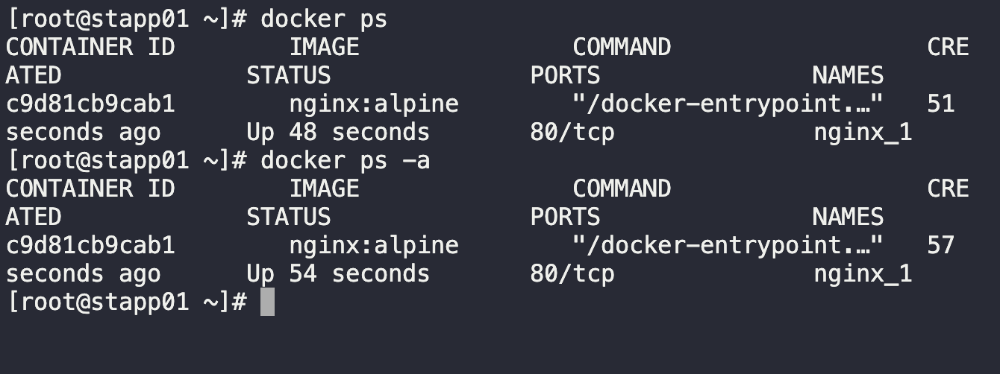

1. Login to server 1
```
ssh tony@stapp01
```

2. Check for existing containers
```
docker ps -a

docker ps
```

3. Create an `nginx` container on server 1
```
docker run --name nginx_1 -d nginx:alpine
```

4. Verify running container
```
docker ps
```

