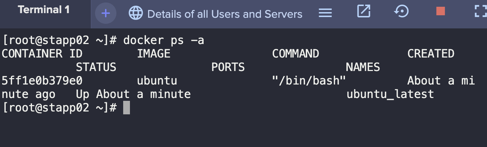
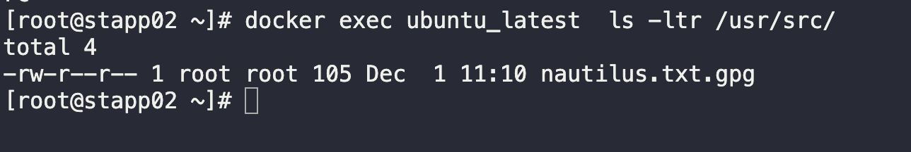

1. SSH into App Server 2.
```
ssh steve@stapp02

sudo su -
```

2. Check for running container.
```
docker ps -a
```



3. Copy the specified file onto the container's directory.
```
docker cp /tmp/nautilus.txt.gpg ubuntu_latest:/usr/src/
```

4. Verify copied file.
```
docker exec ubuntu_latest  ls -ltr /usr/src
```

