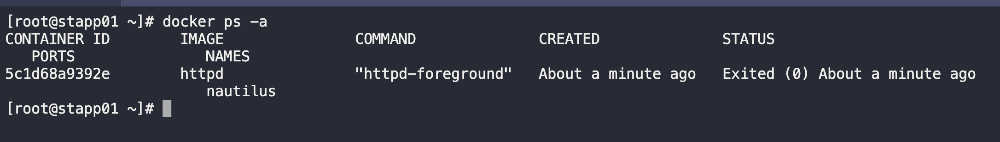
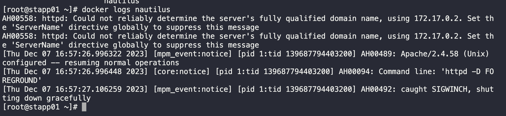
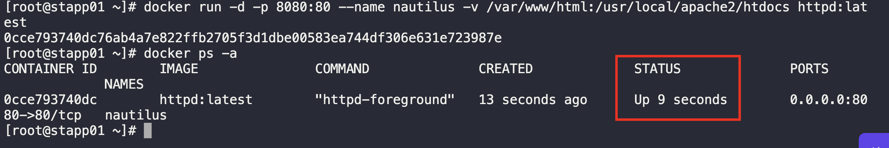
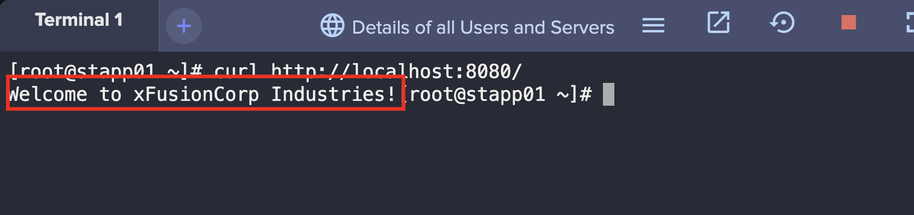

1. SSH into App Server 1
 
2. Check the running container and the logs for that container.
```
docker ps -a

docker logs nautilus
```





3. Delete the existing container and run a new container with the exposed ports and correct volume mapping.
```
docker stop nautilus

docker rm nautilus
```

```
docker run -d -p 8080:80 --name nautilus -v /var/www/html:/usr/local/apache2/htdocs httpd:latest
```



4. Verify
```
curl http://localhost:8080/ 
```

