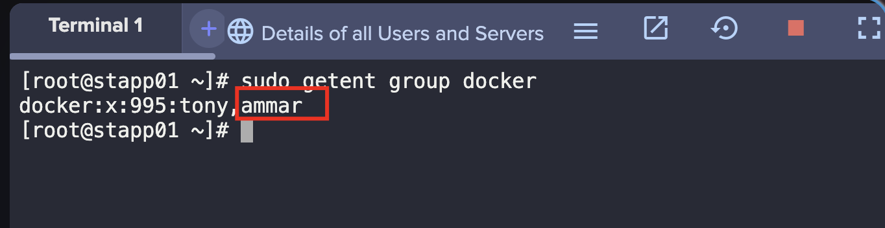
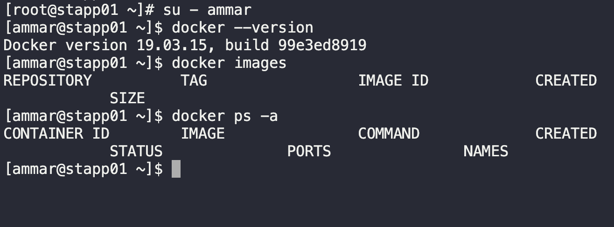

1. Login to the app server 1 and switch to root.
```
ssh tony@stapp01

sudo su -
```

2. Check if docker group exists and which users are added as members.
```
sudo getent group docker
```

3. Add the user `ammar` and verify.
```
sudo usermod -aG docker ammar

sudo getent group docker
```



4. Switch to user rose and check if you can run docker commands.

