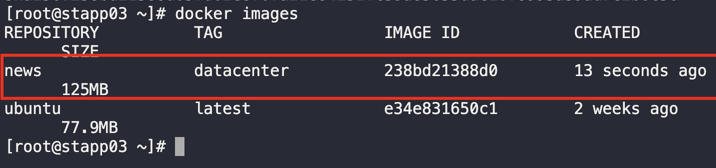

1. SSH into App Server 3

2. Check the running container/s and the current image/s
```
docker ps -a
```

3. Create the image from the container.
```
docker commit ubuntu_latest news:datacenter  
```

4. Verify
```
docker images
```

