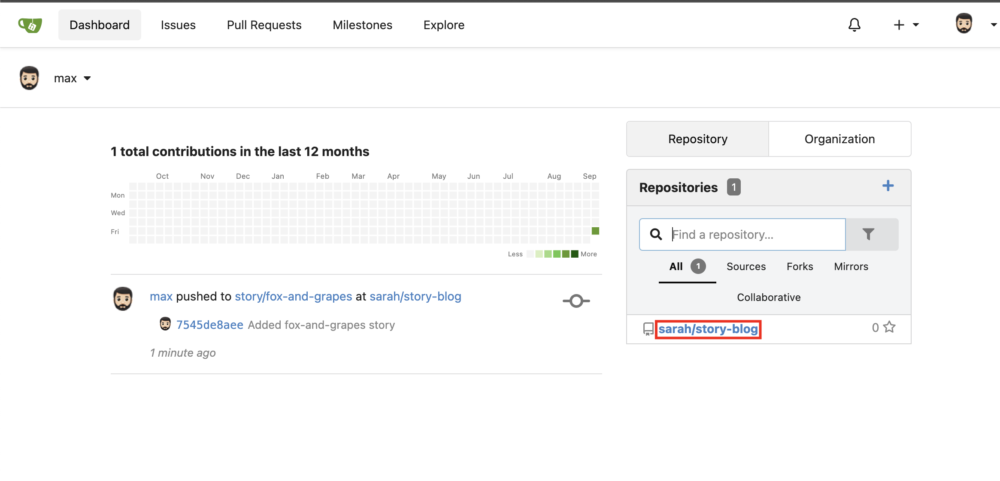
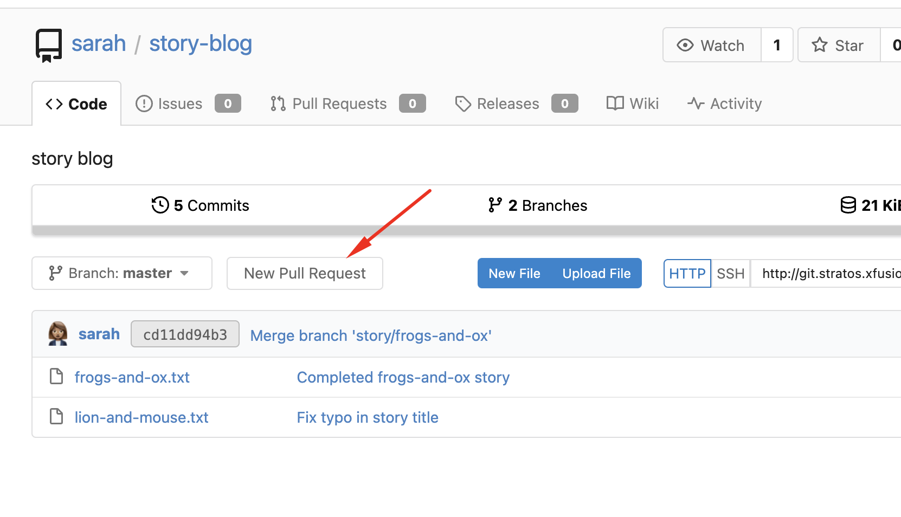
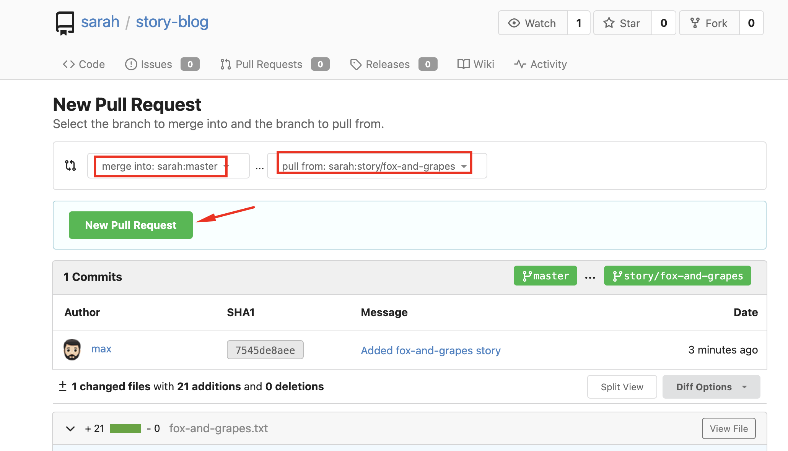
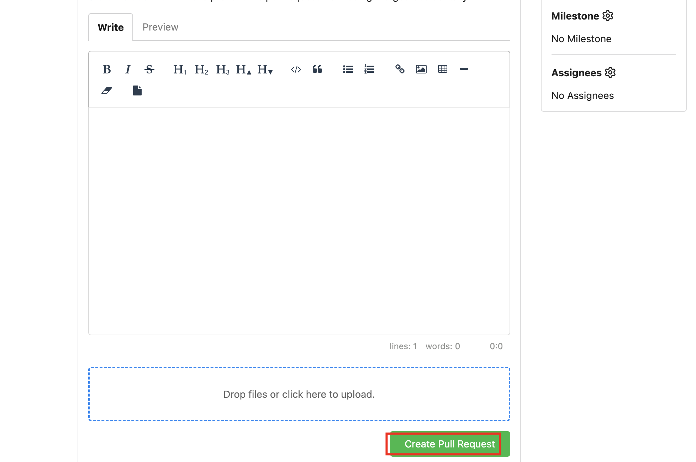
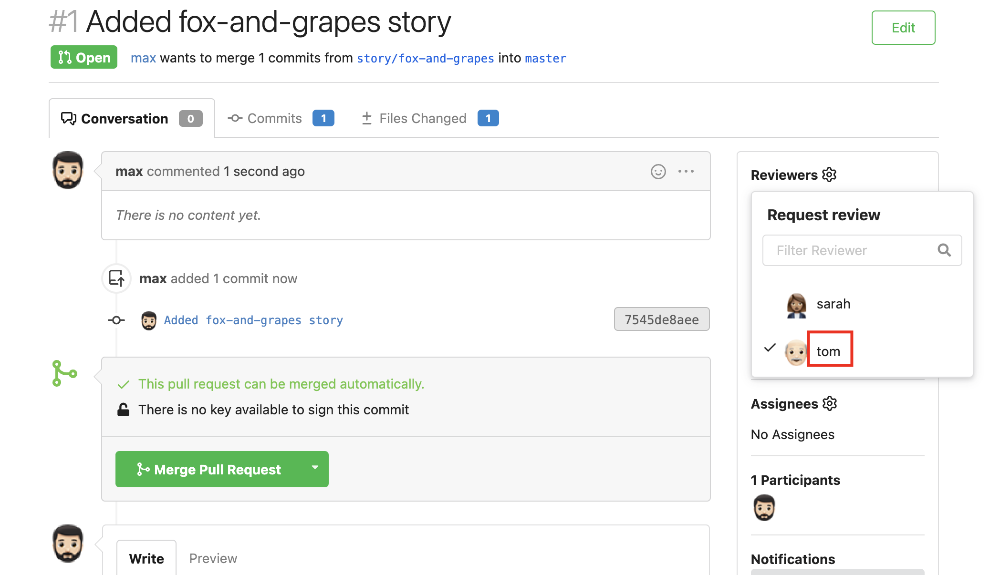
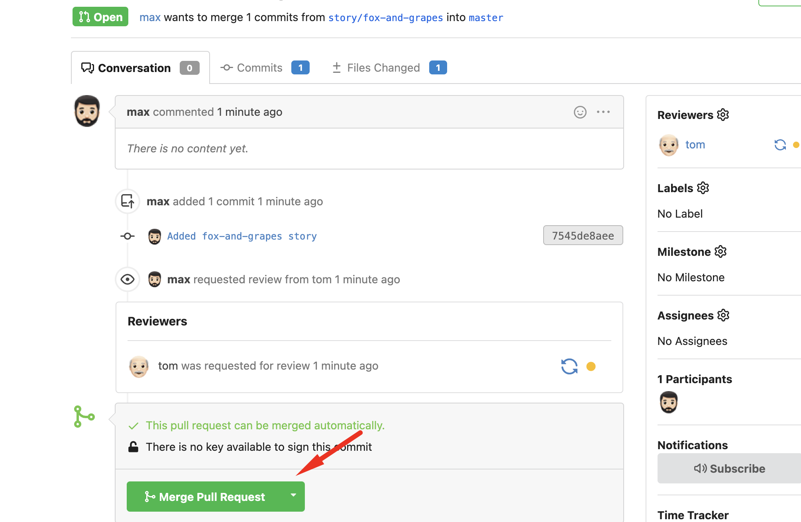
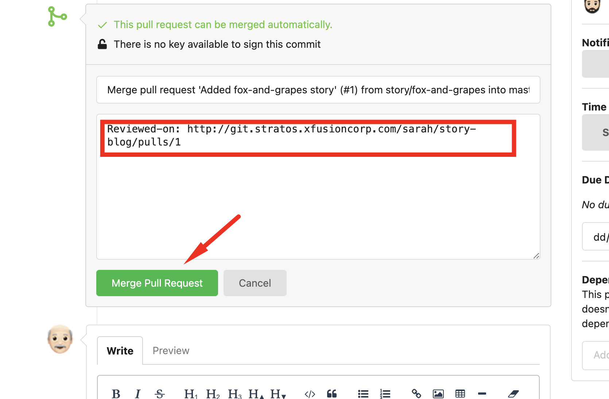
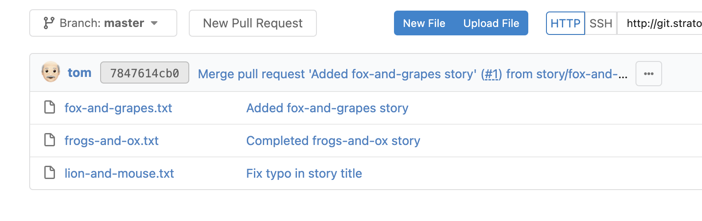

1. SSH into Storage Server
```
ssh max@ststor01
```

2. Navigate and Confirm the story in the cloned repo
```
cd story-blog
cat fox-and-grapes.txt

git log
```

3. Using the Gitea UI button, access the gitea page



4. Create a new pull request







5. Add tom as a reviewer



6. Logout as max, then login as tom


7. Review and Merge pull request





