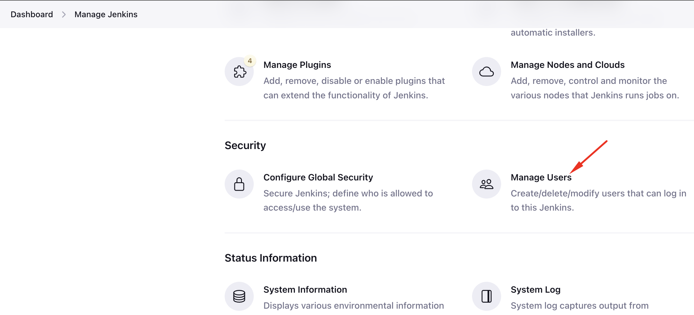

1. Access Jenkins UI to login

2. Go to `Manage Jenkins`, choose `Manage Users` to create user.

3. Under `Manage Jenkins`, go to `Manage Plugins`, then install `Project-based Matrix Authorization Strategy`/`Matrix-based Security`, then restart Jenkins

4. Under `Manage Jenkins` --> `Configure Global Security` --> Under Authorization, choose `Matrix-based Security`

* Give admin `Administer` permission

* Add user `jim`, give `overall read` permission and `read` permission on Jobs

