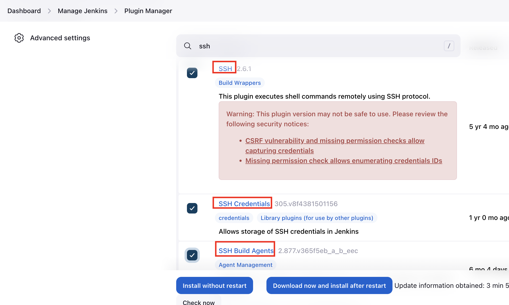
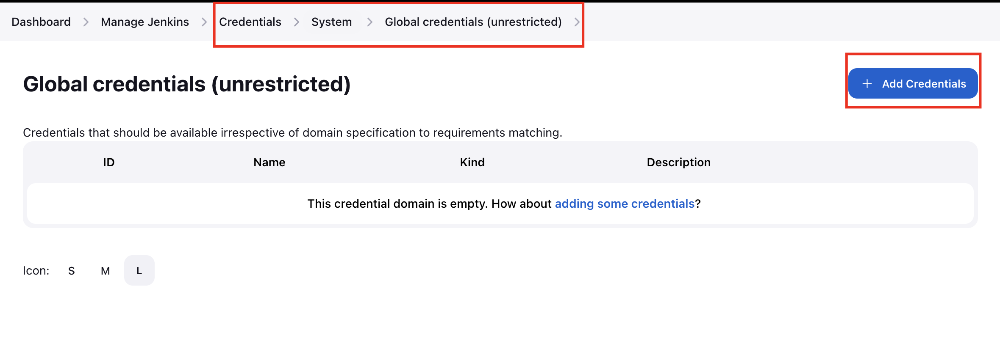

1. Access Jenkins UI to login

2. Install the necessary plugins



3. Add credentials of the storage server





4. Under `Manage Jenkins` --> `Configure System` --> `SSH sites`, to allow connection from the server to jenkins. 

* Note: Check for successful connection


5. Create a job `install-packages`


6. Add a string parameter named `PACKAGE`


7. Under `install-packages` job --> `Configuration` --> `Build Steps` --> `Execute shell script on remote host using ssh`, give the necessary command

```
echo <storage-server-password> | sudo -S yum install -y $PACKAGE
```


8. To verify connection between the server and jenkins, install a package {nginx}, using `Build with parameters`


