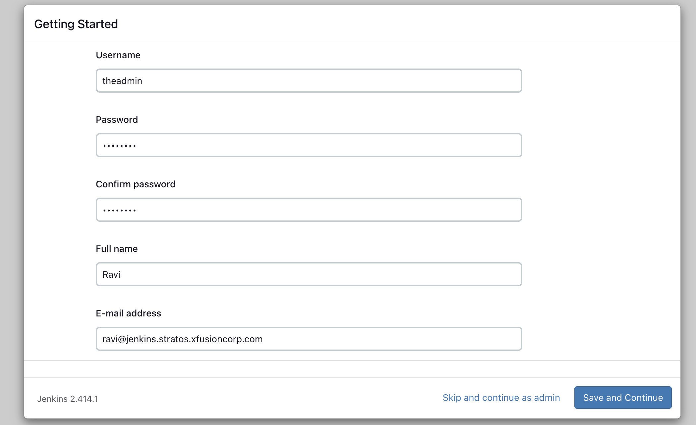
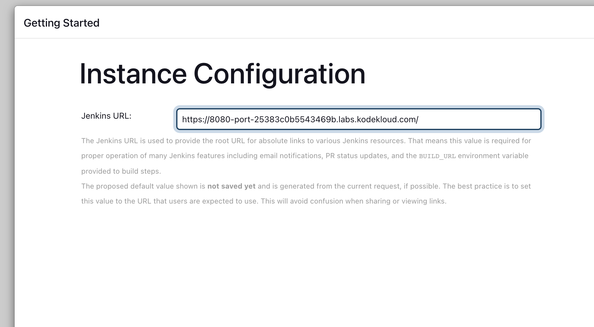
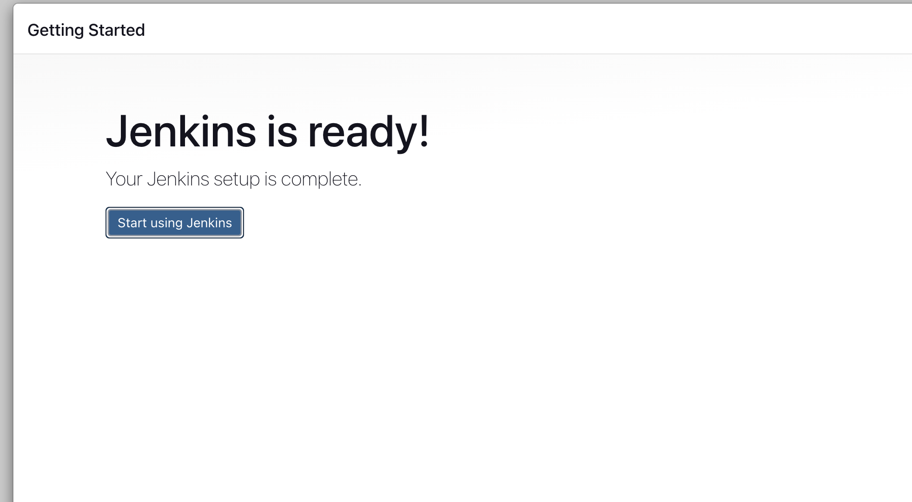
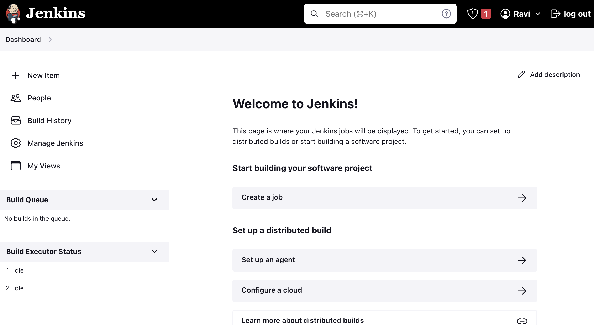

1. SSH into the jenkins server via the root user
```
ssh root@jenkins
```

2. Install jenkins and its dependencies
```
sudo wget -O /etc/yum.repos.d/jenkins.repo \
    https://pkg.jenkins.io/redhat/jenkins.repo
sudo rpm --import https://pkg.jenkins.io/redhat/jenkins.io-2023.key
sudo dnf upgrade -y
sudo dnf install java-17-openjdk -y
sudo dnf install jenkins -y
```

3. Start and enable jenkins 
```
sudo systemctl enable jenkins
sudo systemctl start jenkins
```

4. Click on the jenkins button to access its UI, then create a user






