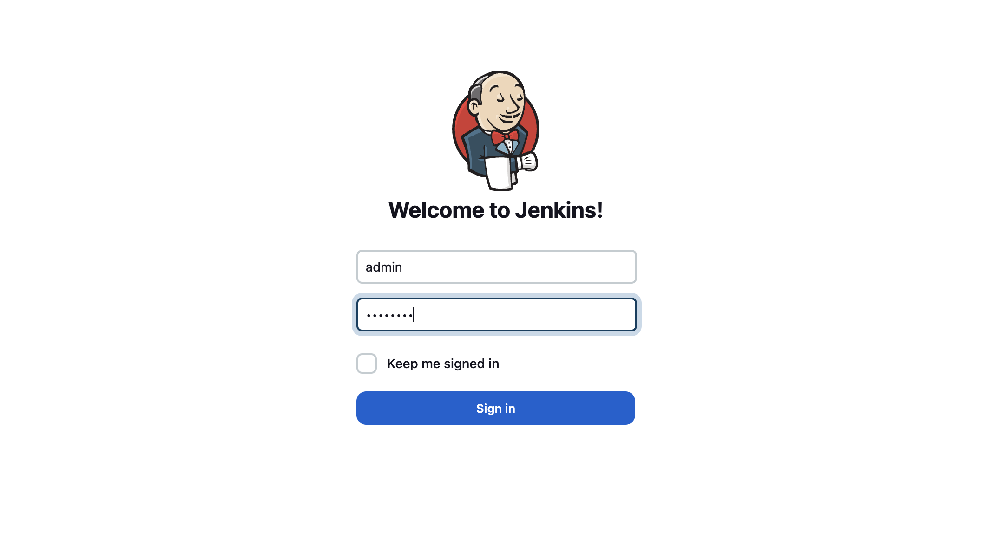
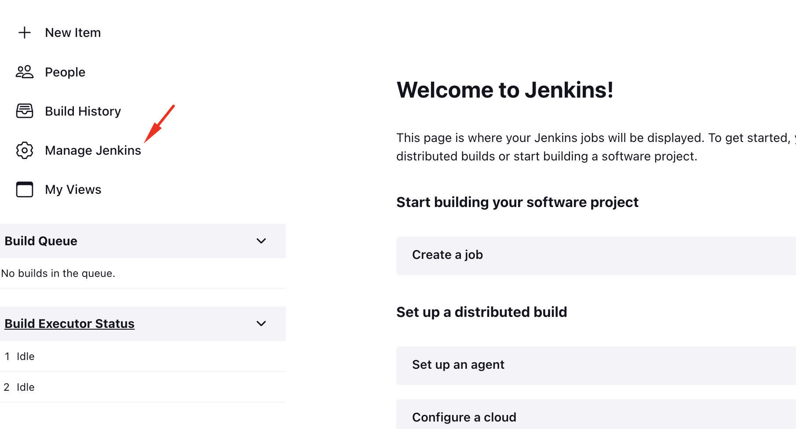
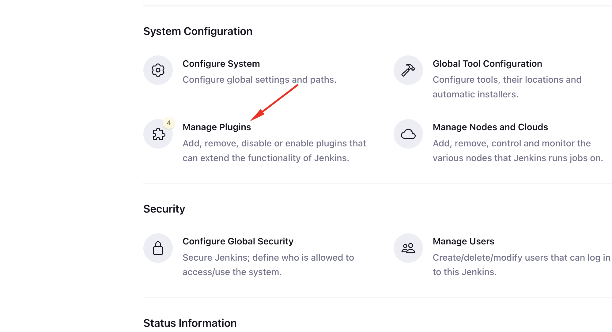
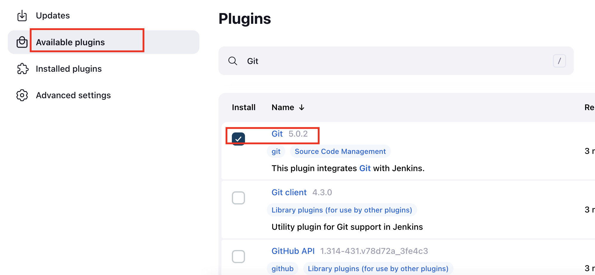
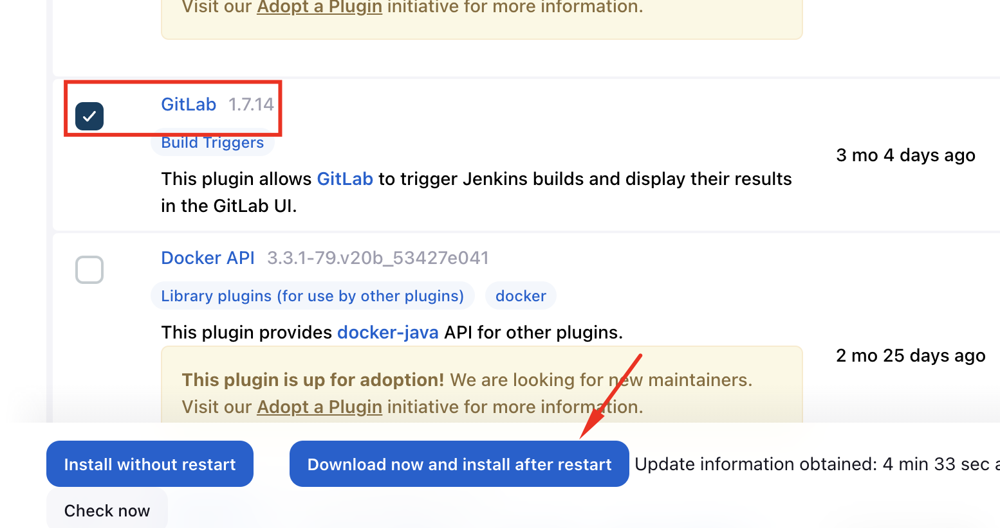
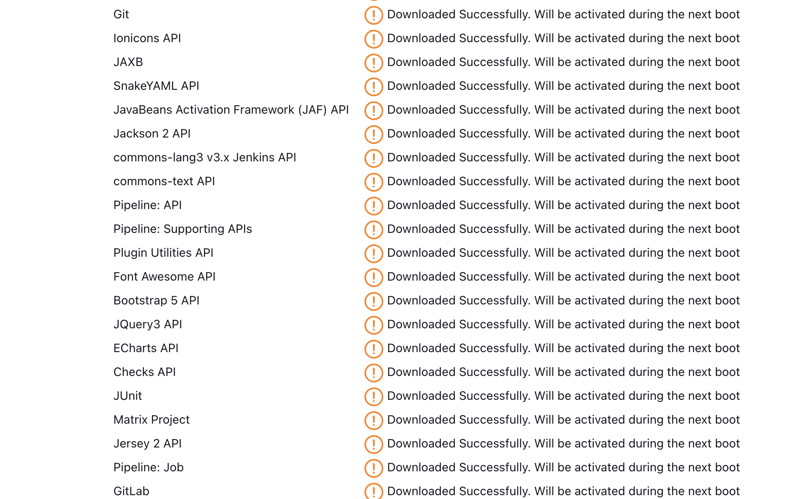
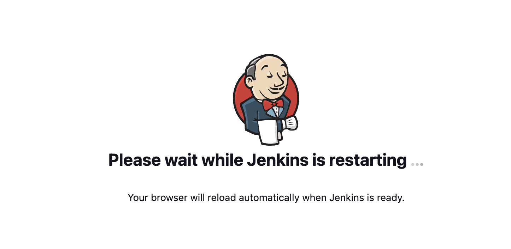
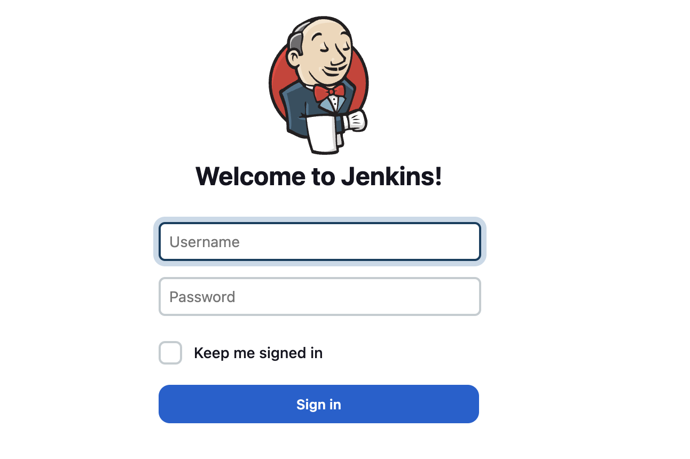

1. Access Jenkins UI to login

2. Once logged in, click on `Manage Jenkins`

3. Choose `Manage Plugins`

4. Under `Available Plugins`, Choose `Git` and `GitLab`

5. Then, install plugins

6. Tick the `Restart Jenkins when installation is complete and no jobs are running` in the installation page

