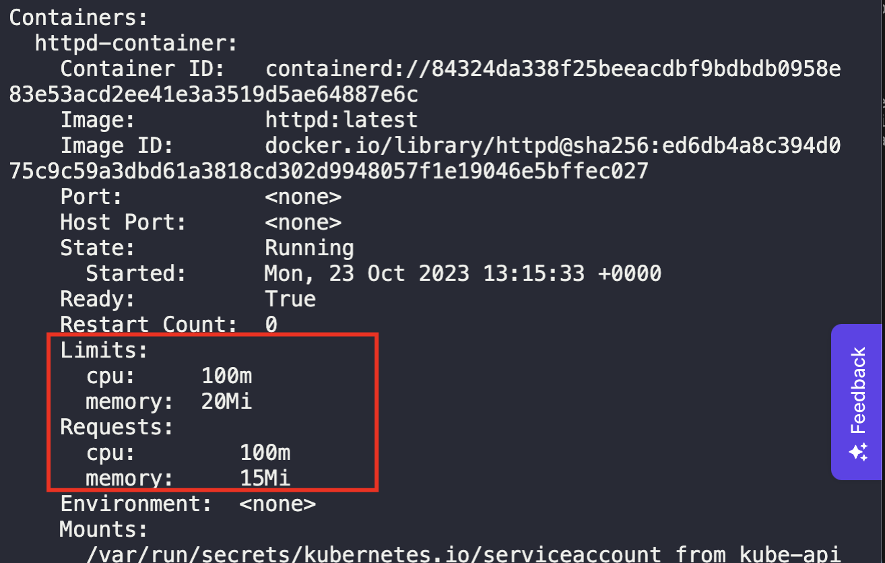

1. Generate POD Manifest YAML file (-o yaml), and save to a file
```
kubectl run httpd-pod --image=httpd:latest --dry-run=client -o yaml > pod.yaml
```

2. Add the `requests` and `limits` resources under `spec.containers`
```
spec:
  containers:
  - image: httpd:latest
    name: httpd-container
    resources: 
      requests:
        memory: "15Mi"
        cpu: 100m
      limits: 
        memory: "20Mi"
        cpu: 100m
```

3. Create the pod
```
kubectl create -f pod.yaml
```

4. Validate the added resources in the running pod
```
kubectl describe pod httpd-pod
```

