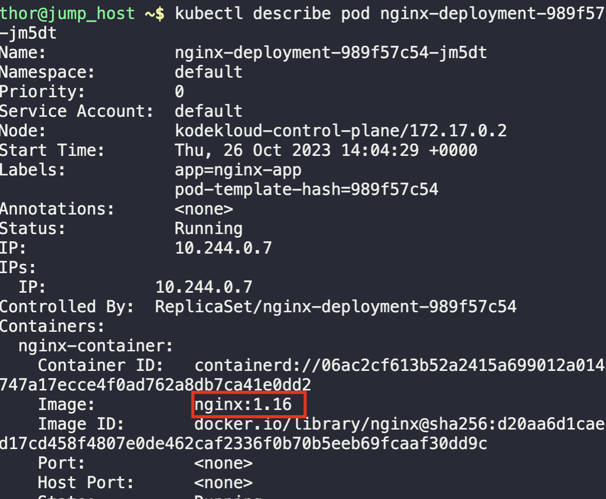
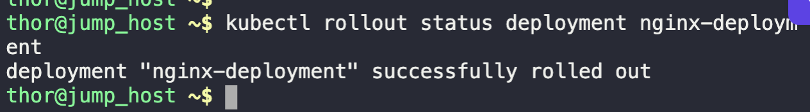
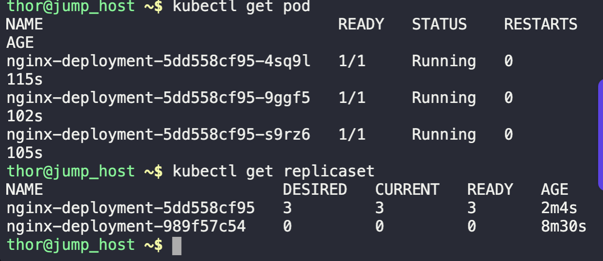
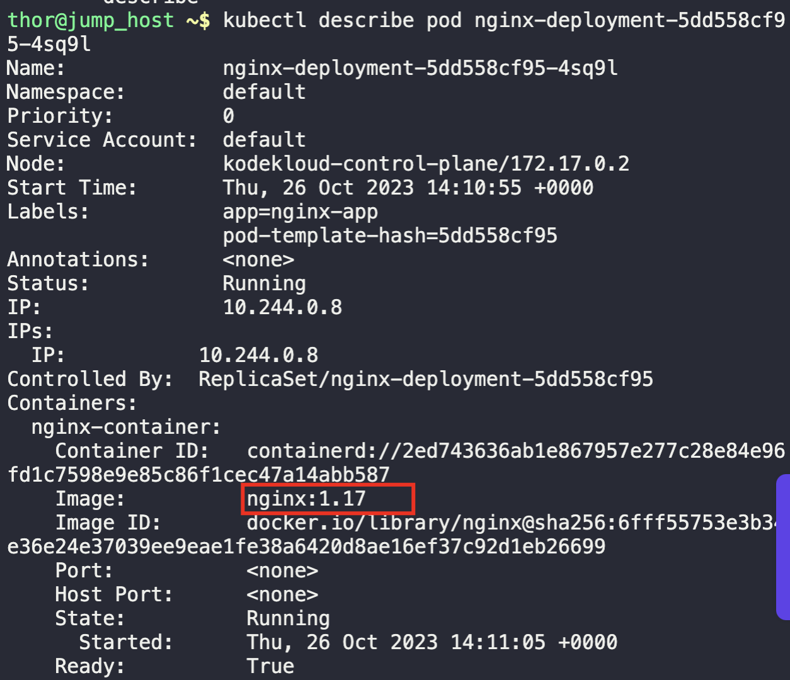

1. Check the image of the running pods
```
kubectl get pods

kubectl describe pod {pod-name}
```



2. Edit the image of the deployment from `nginx:1.16` to `nginx:1.17`
```
kubectl edit deployment nginx-deployment
```

3. Validate for rollout status
```
kubectl rollout status deployment nginx-deployment

kubectl get replicaset

kubectl describe pod {pod-name}
```





