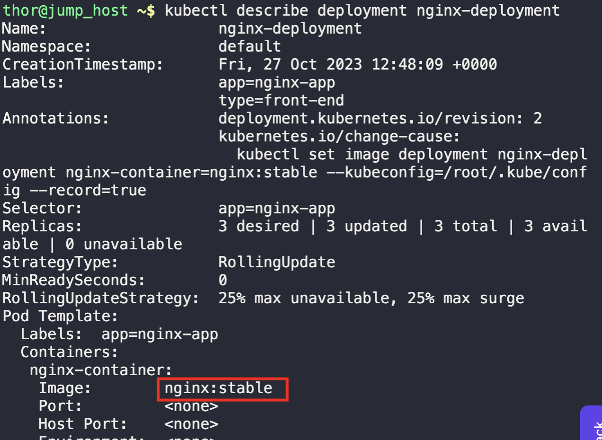
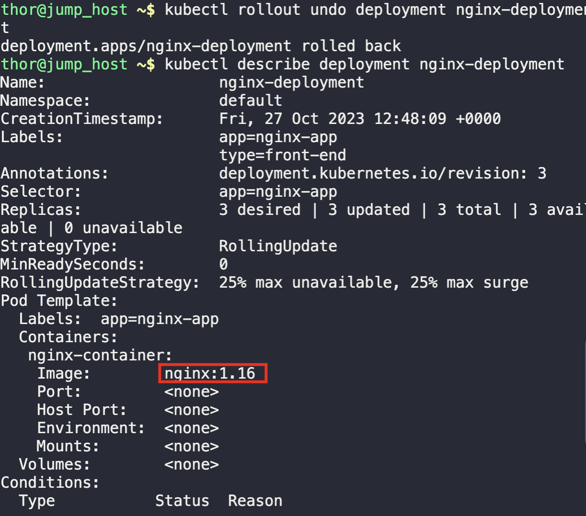

1. Check the updated deployment
```
kubectl describe deployment nginx-deployment
```



2. Rollback the update
```
kubectl rollout undo deployment nginx-deployment
```

3. Validate for successful rollback
```
kubectl describe deployment nginx-deployment
```

