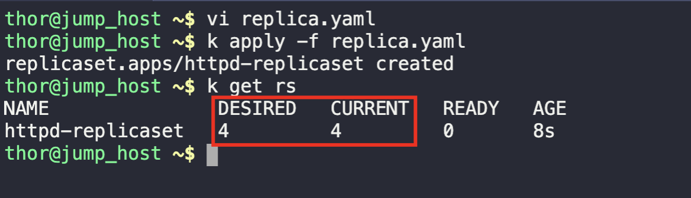
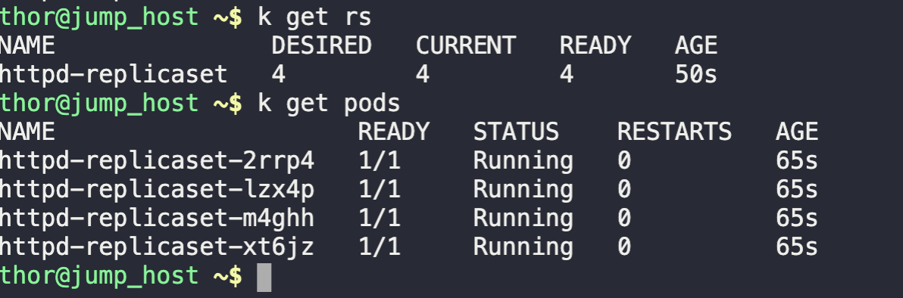

1. Create a replicaset using declarative method
```
vi replicaset.yaml

kubectl apply -f replicaset.yaml
```

2. Check the newly created replicaset
```
kubectl get replicaset

OR

k get rs
```



3. Validate the replica pods are running
```
kubectl get pod
```

