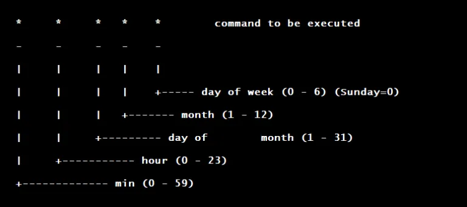

# CRONJOBS IN K8s

A CronJob creates jobs on a repeating schedule. CronJob is meant for performing regular scheduled actions such as backups, report generation, and so on.

### Syntax of a Cronjob

## Task:

There are some jobs/tasks that need to be run regularly on different schedules. Currently the Nautilus DevOps team is working on developing some scripts that will be executed on different schedules, but for the time being the team is creating some cron jobs in Kubernetes cluster with some dummy commands (which will be replaced by original scripts later). Create a cronjob as per details given below:

1. Create a cronjob named `devops`.

2. Set Its schedule to something like `*/5 * * * *`, you set any schedule for now.

3. Container name should be `cron-devops`.

4. Use `httpd` image with latest tag only and remember to mention the tag i.e `httpd:latest`.

5. Run a dummy command `echo "Welcome to xfusioncorp!"`.

6. Ensure restart policy is `OnFailure`.