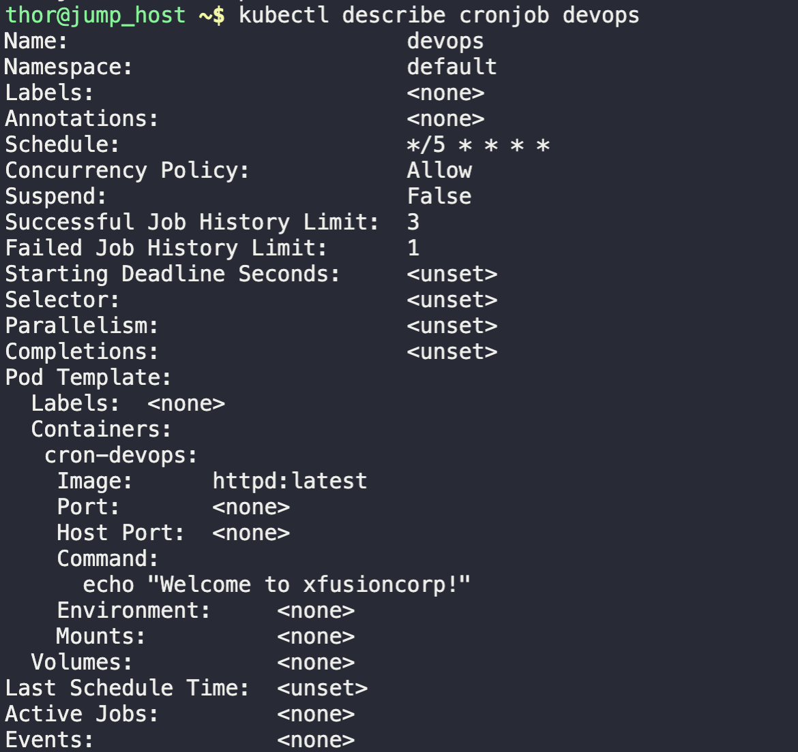

1. Check for any running cronjob
```
kubectl get cronjob
```

2. Create a manifest file for the task
```
vi cronjob.yaml
```

* Note: apiVersion for cronjob is `batch/v1`, and kind is `CronJob`

3. Create the cronjob
```
kubectl apply -f cronjob.yaml
```

4. Describe the created cronjob to get more detail
```
kubectl describe cronjob devops
```

