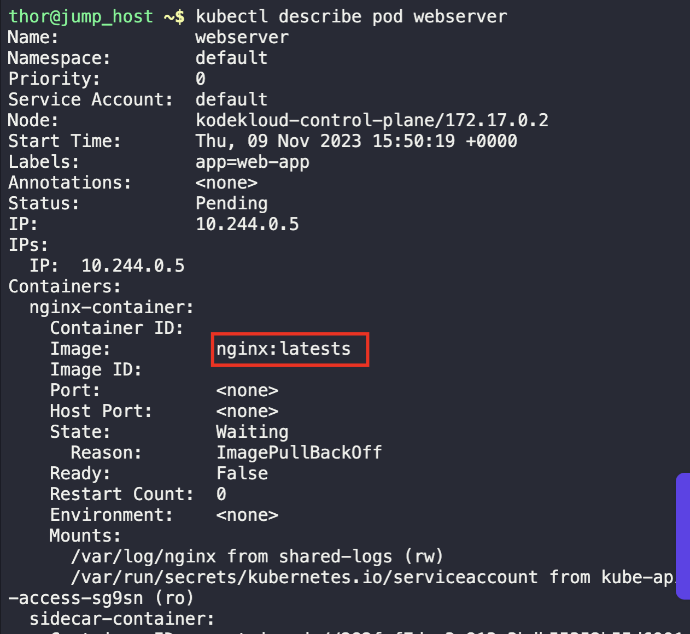
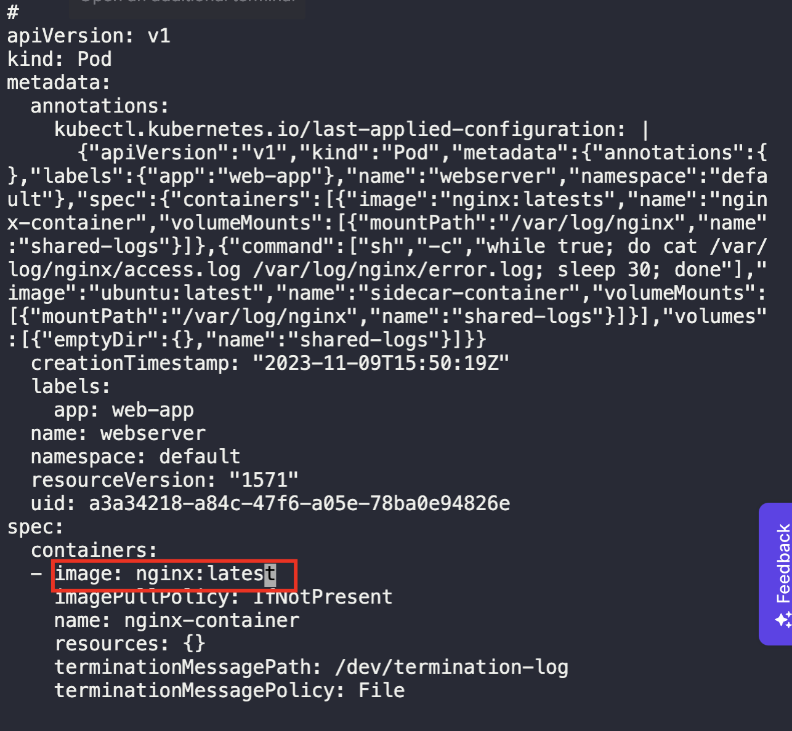
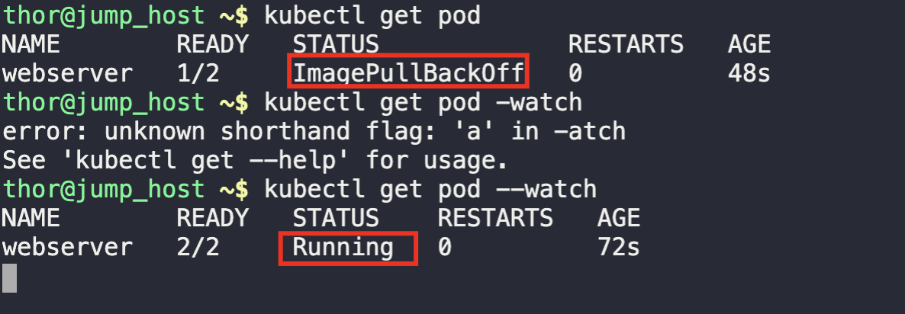

1. Check the pod for errors
```
kubectl describe pod webserver
```



2. Edit the pod file to correct the error
```
kubectl edit pod webserver
```



3. Validate running pod
```
kubectl get pod
```

