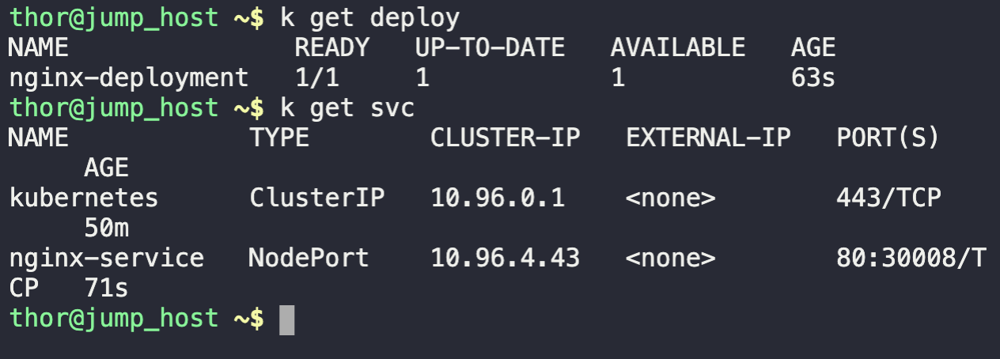
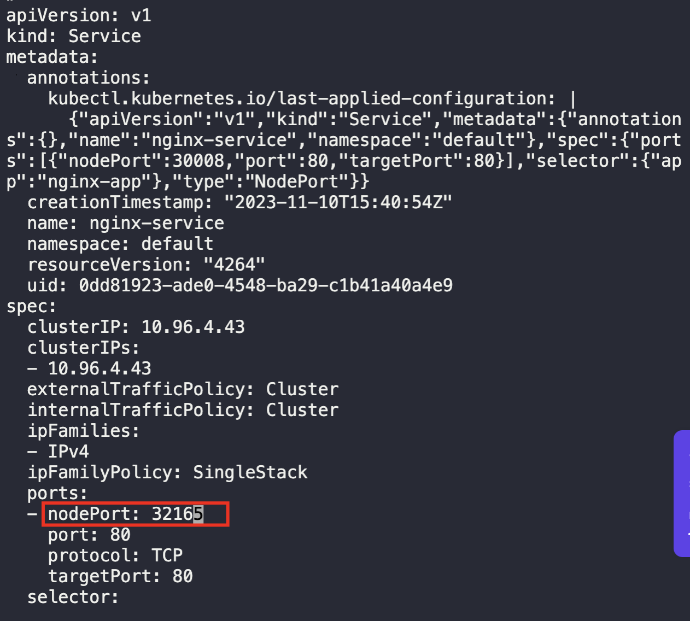
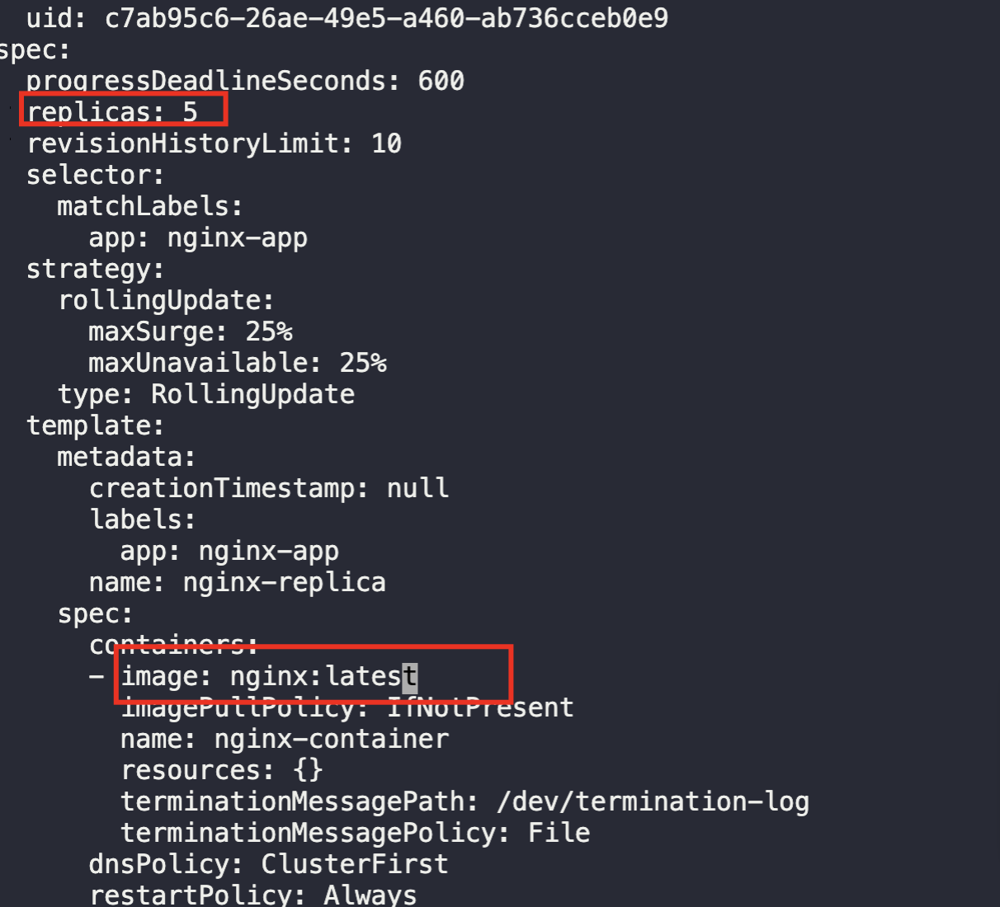
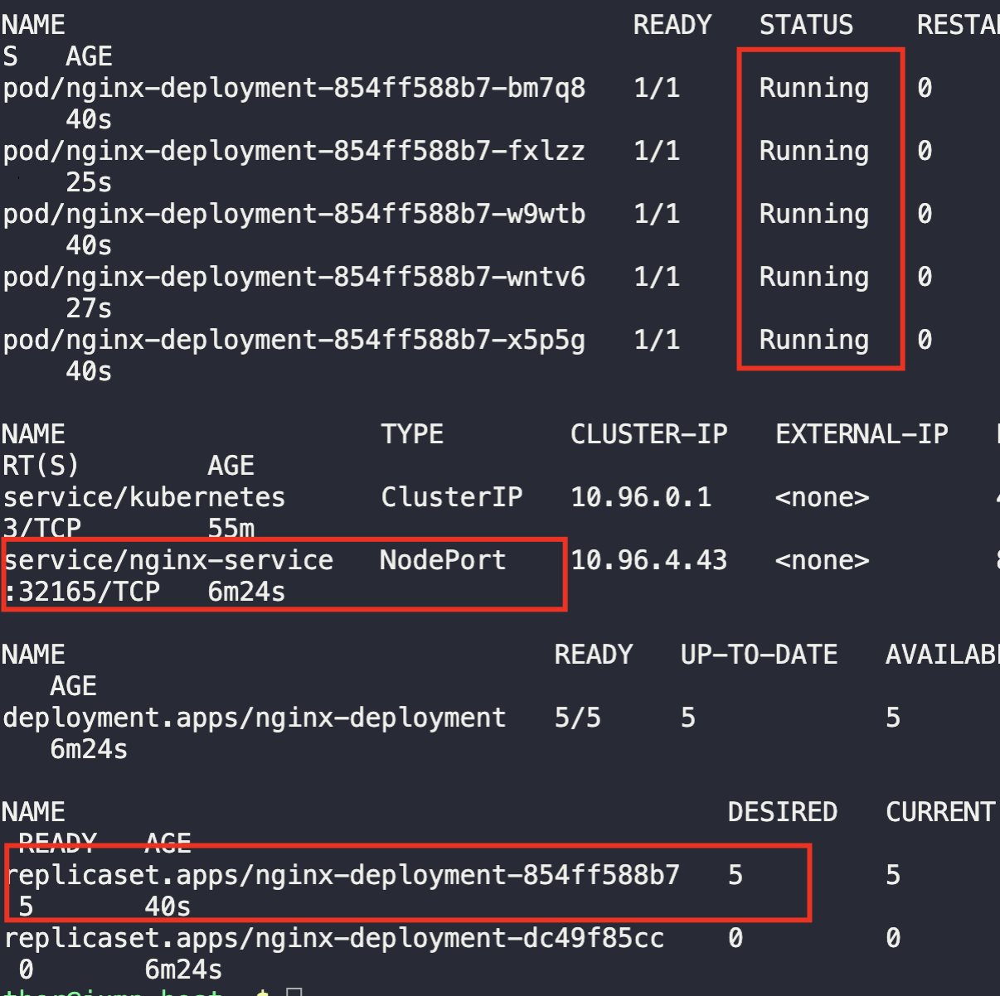

1. Verify deployment and service
```
kubectl get deploy

kubectl get svc
```



2. Edit service to change `nodeport`
```
kubectl edit service nginx-service
```



3. Edit deployment to change `replicas` and `image`
```
kubectl edit deployment nginx-deployment
```



4. Validate successful changes
```
kubectl get all
```

