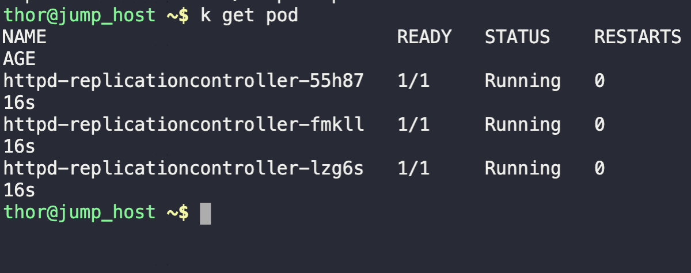

1. Write a Replication Controller file
```
vi pod.yaml

---

apiVersion: v1
kind: ReplicationController
metadata:
  name: httpd-replicationcontroller
  labels:
    app: httpd_app
    type: front-end
spec:
  replicas: 3
  selector:
    app: httpd_app
  template:
    metadata:
      name: httpd_pod
      labels:
        app: httpd_app
        type: front-end
    spec:
      containers:
        - name: httpd-container
          image: httpd:latest
          ports:
            - containerPort: 80
```

2. Create the file
```
kubectl create -f pod.yaml
```

3. Validate running pods
```
k get pods
```

