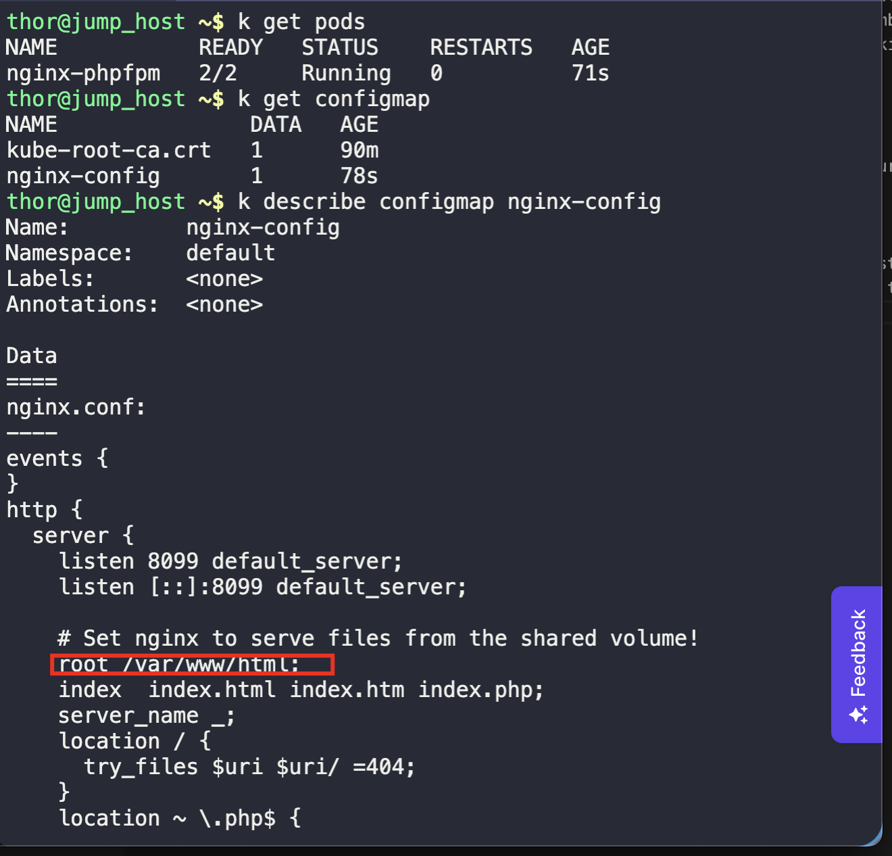
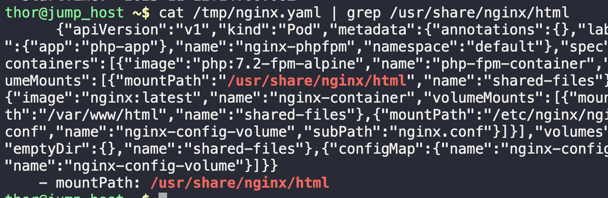
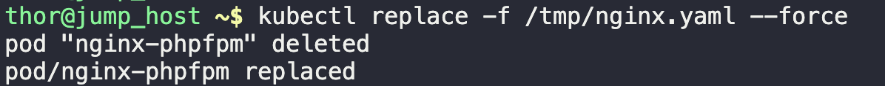
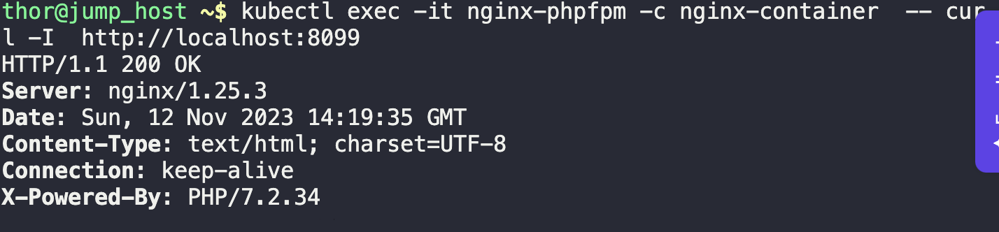
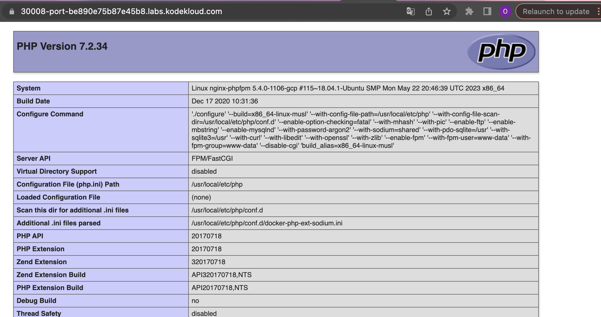

1. Check existing pods, and shared volume path in existing configmap
```
kubectl get pods

kubectl get configmap

kubectl describe configmap nginx-config
```



2. Get the pod configuration into a yaml file
```
kubectl get pod nginx-phpfpm -o yaml > /tmp/nginx.yaml

cat /tmp/nginx.yaml
```

3. Edit the yaml file, to change `/usr/share/nginx/html` to `/var/www/html`
```
cat /tmp/nginx.yaml | grep /usr/share/nginx/html
```



4. Apply changes by replacing the running pods
```
kubectl replace -f /tmp/nginx.yaml --force
```



5. Copy the index file from `jump_host` to the `nginx-container`
```
ls /home/thor

kubectl cp /home/thor/index.php nginx-phpfpm:/var/www/html -c nginx-container
```

6. Validate task by curling the nginx port, and accessing the web UI
```
kubectl exec -it nginx-phpfpm -c nginx-container -- curl -I http://localhost:8099
```



