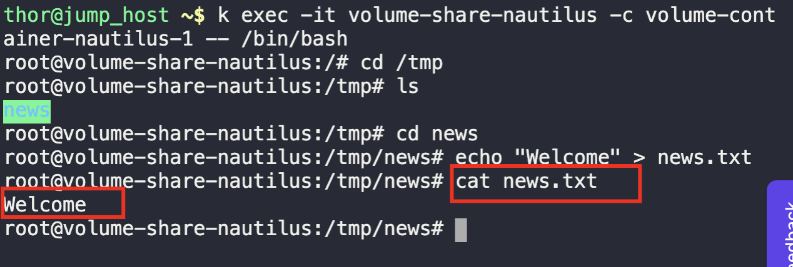
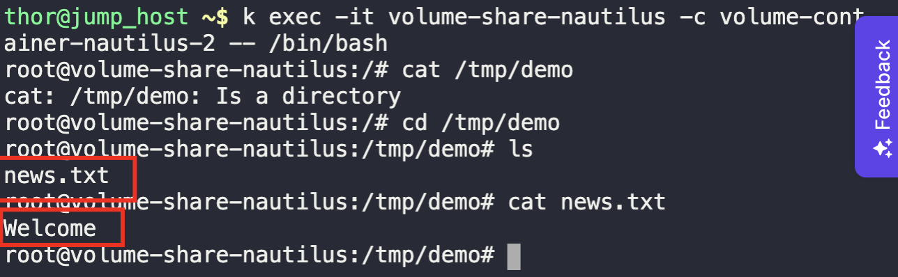

1. Create a yaml file, with all the given parameters
```
kubectl create -f pod.yaml

kubectl get pods
```

2. `exec` into the first container
```
kubectl exec -it {Pod-name} -c {container-name} -- /bin/bash
```

3. Create a file with any content, under the mounted path
```
cd /tmp/news

echo "Welcome" > news.txt
```



4. `exec` into the second container, to verify shared volume
```
kubectl exec -it {Pod-name} -c {container-name} -- /bin/bash
```

```
cd /tmp/demo

ll

cat news.txt
```

