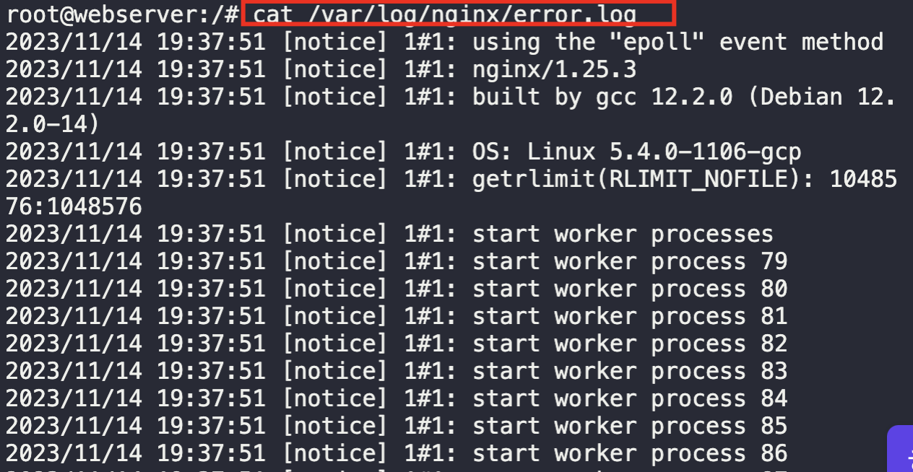

1. Create a pod named `webserver`, using declarative approach (yaml) as per given task
```
kubectl create -f pod.yaml
```

2. Validate running pods
```
kubectl get pods
```


3. `exec` into the sidecar-container to verify logs
```
kubectl exec -it webserver -c sidecar-container -- /bin/bash

cat /var/log/nginx/error.log
```

