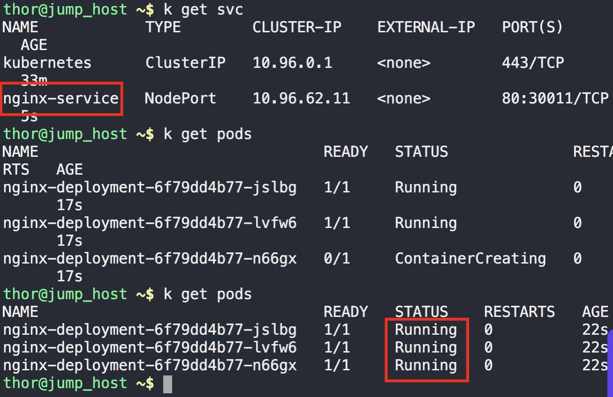

1. Check existing deployment and pods
```
kubectl get deployment

kubectl get pods
```

2. Create a YAML file with all the parameters
```
kubectl create -f deploy.yaml
```

3. Verify running pods and service
```
k get svc

k get pod
```

