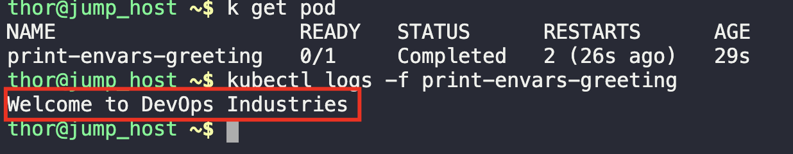

1. Create a yaml file with all the given parameters
```
kubectl create -f env.yaml
```

2. Ensure the pod is in running state
```
kubectl get pods
```

3. Validate the output
```
kubectl logs -f print-envars-greeting
```

