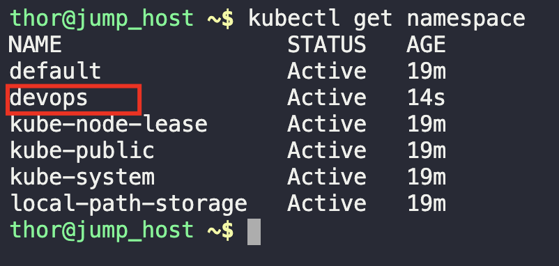
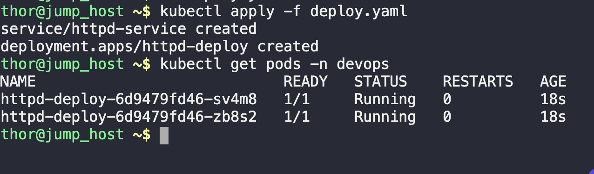
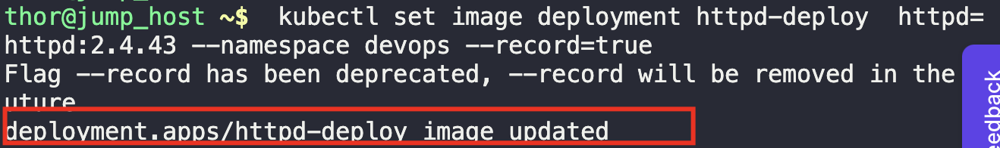
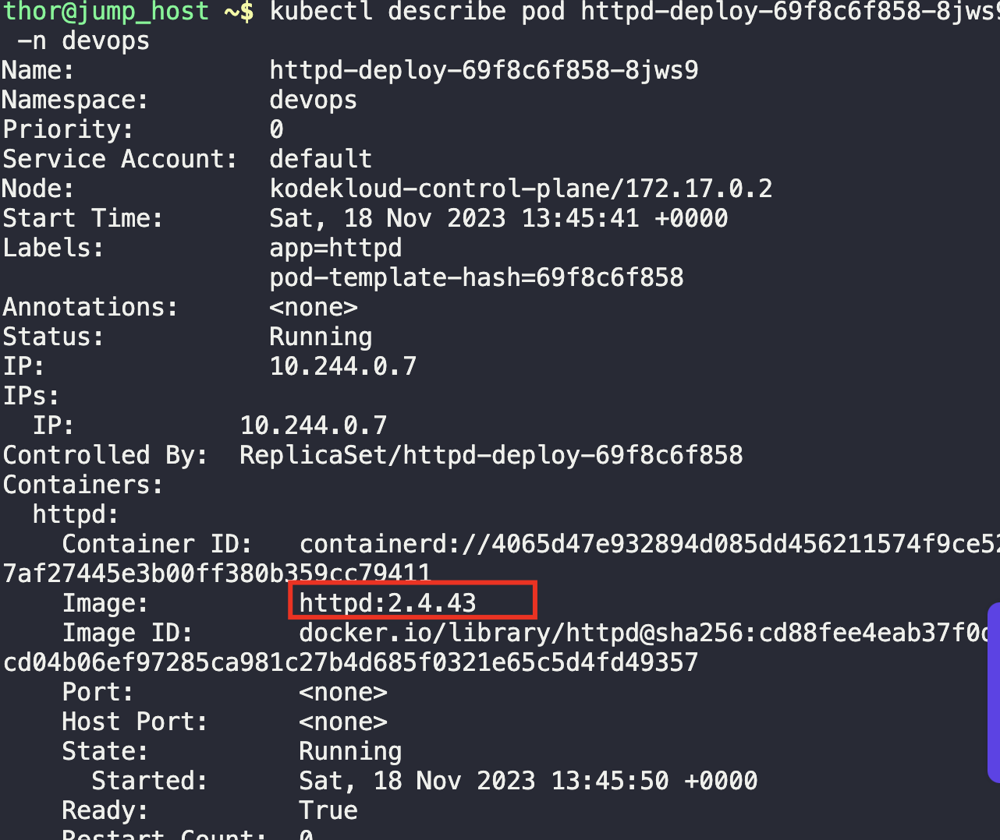
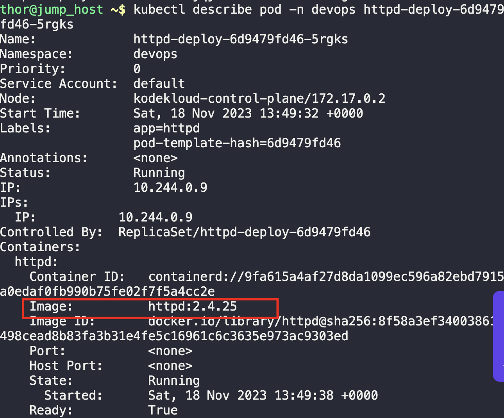

1. Create a namespace called `devops`
```
kubectl create namespace devops

kubectl get namespace
```



2. Create the deployment file with all the parameters, and allow the pods to be in a running state
```
kubectl apply -f devops.yaml

kubectl get pods -n devops
```



3. Perform a rolling update
```
kubectl set image deployment httpd-deploy  httpd=httpd:2.4.43 --namespace devops

kubectl describe pod {pod-name} -n devops
```





4. Rollback the deployment as per task
```
kubectl rollout undo deployment httpd-deploy  -n devops

kubectl describe pod {pod-name} -n devops
```

