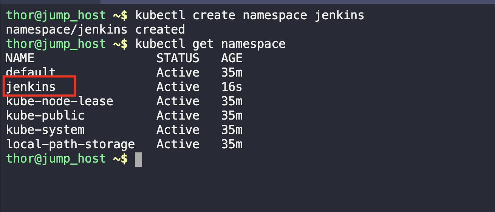
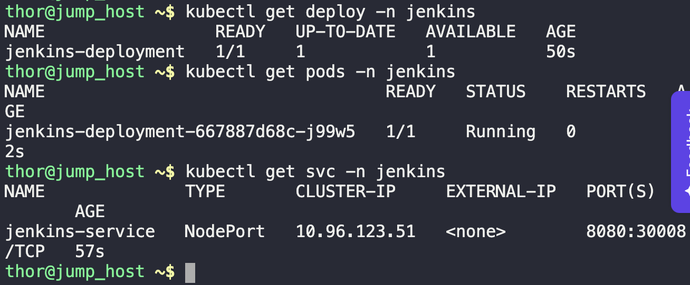
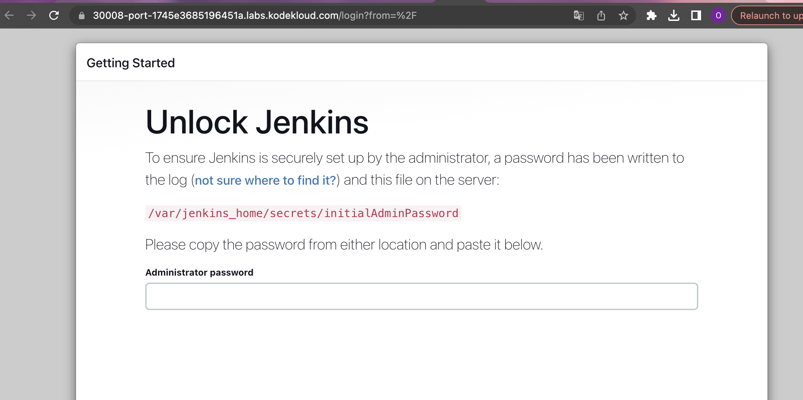

1. Create a namespace `jenkins`
```
kubectl create namespace jenkins

kubectl get namespace
```



2. Create a deployment with the given parameters
```
vi jenkins.yaml

kubectl create -f jenkins.yaml
```

3. Wait for deployment and pods to be in a running state
```
kubectl get deploy -n jenkins

kubectl get pods -n jenkins

kubectl get svc -n jenkins
```



4. Validate task by accessing the Jenkins login UI

