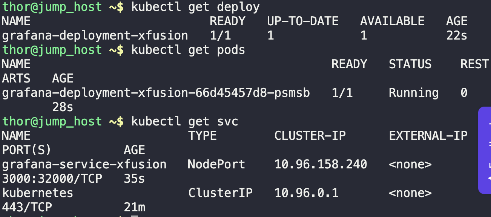
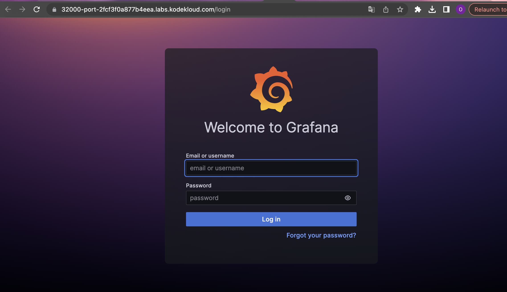

1. Create the deployment with all necessary parameters
```
vi grafana.yaml

kubectl create -f grafana.yaml
```

2. Verify running deployment and pods
```
k get deploy

k get pods

k get svc
```



3. Validate successful task by accessing grafana login UI

