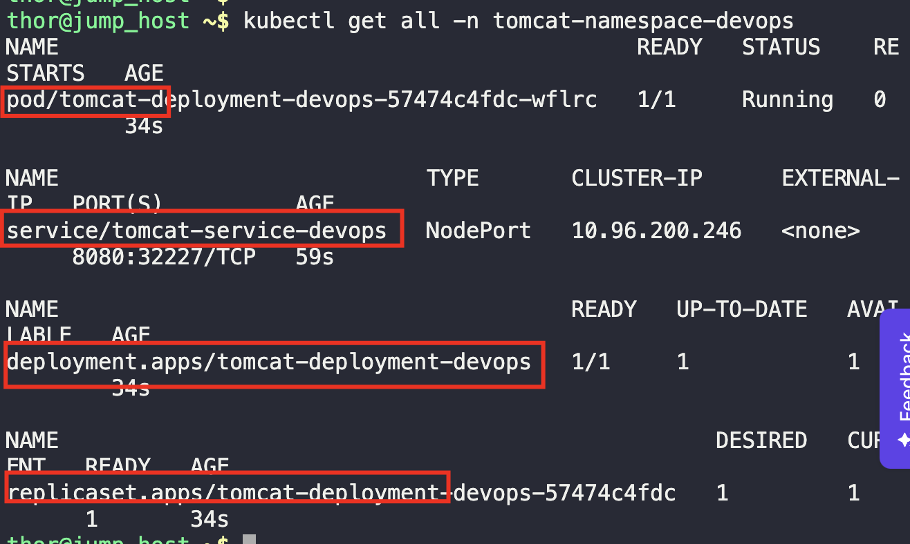

1. Create the given namespace
```
kubectl create namespace tomcat-namespace-devops

kubectl get namespace
```


2. Create the deployment and service as per task
```
vi tomcat.yaml

kubectl create -f tomcat.yaml
```



3. Verify a running application

