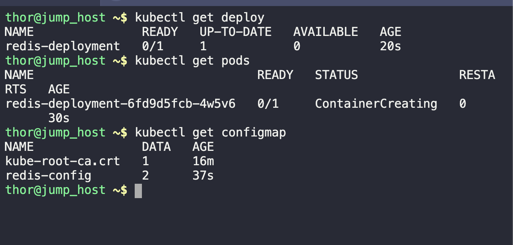
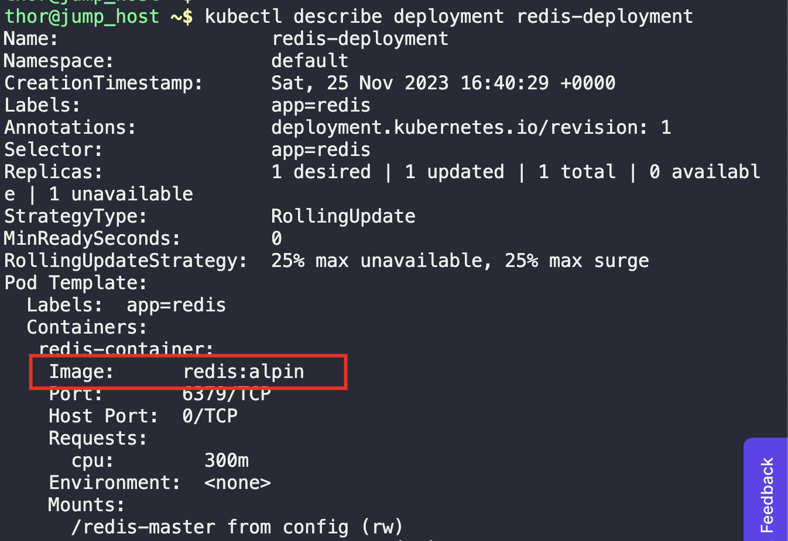
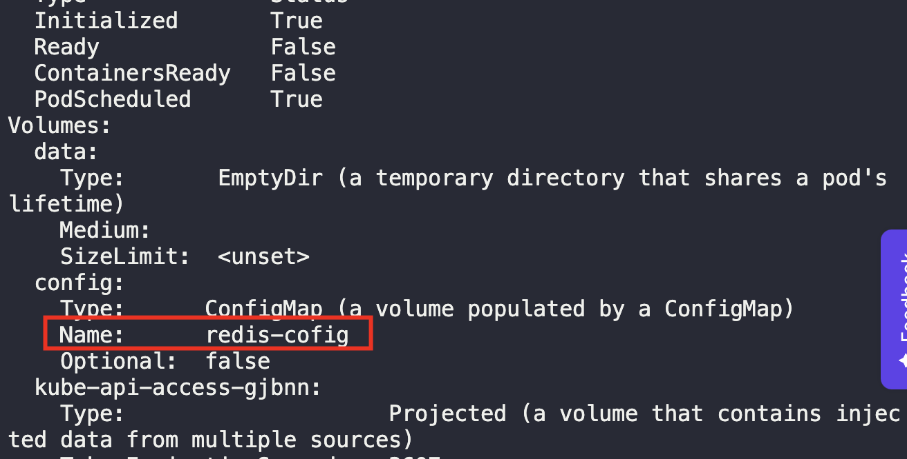
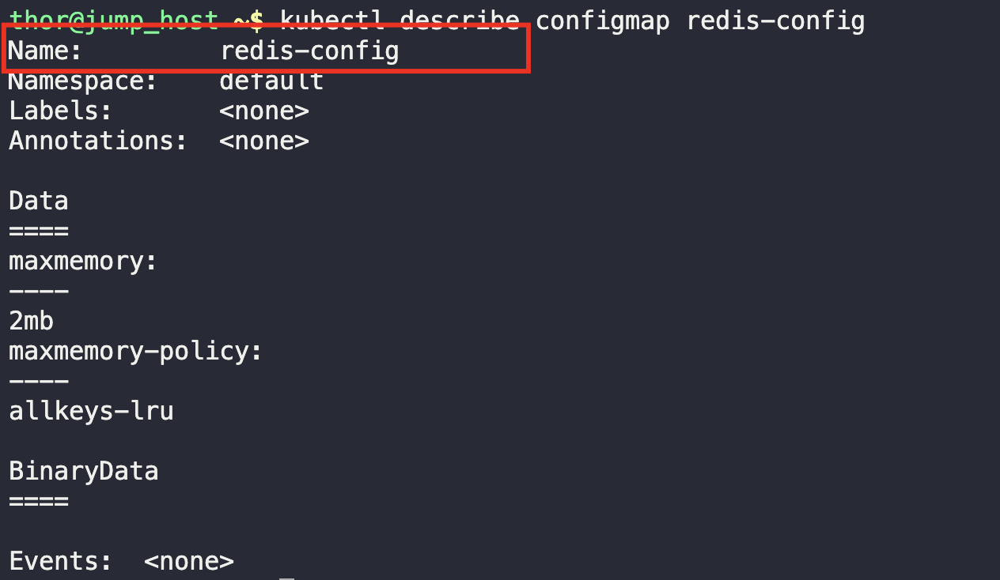
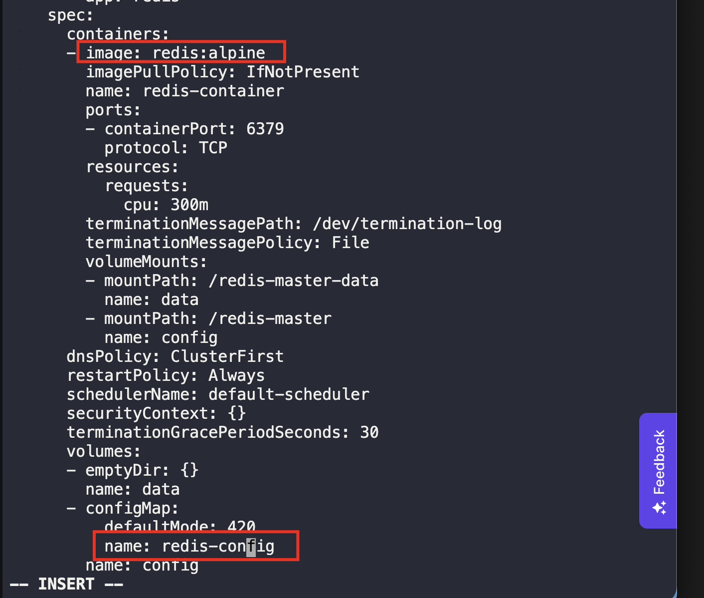
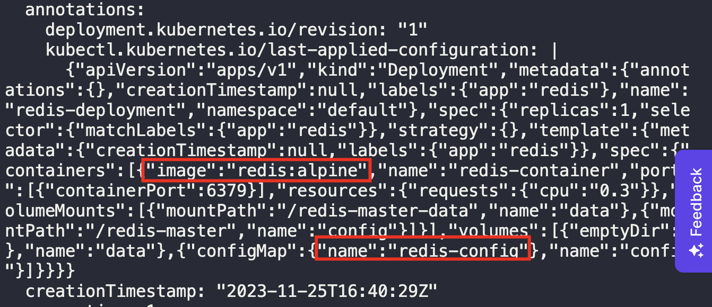
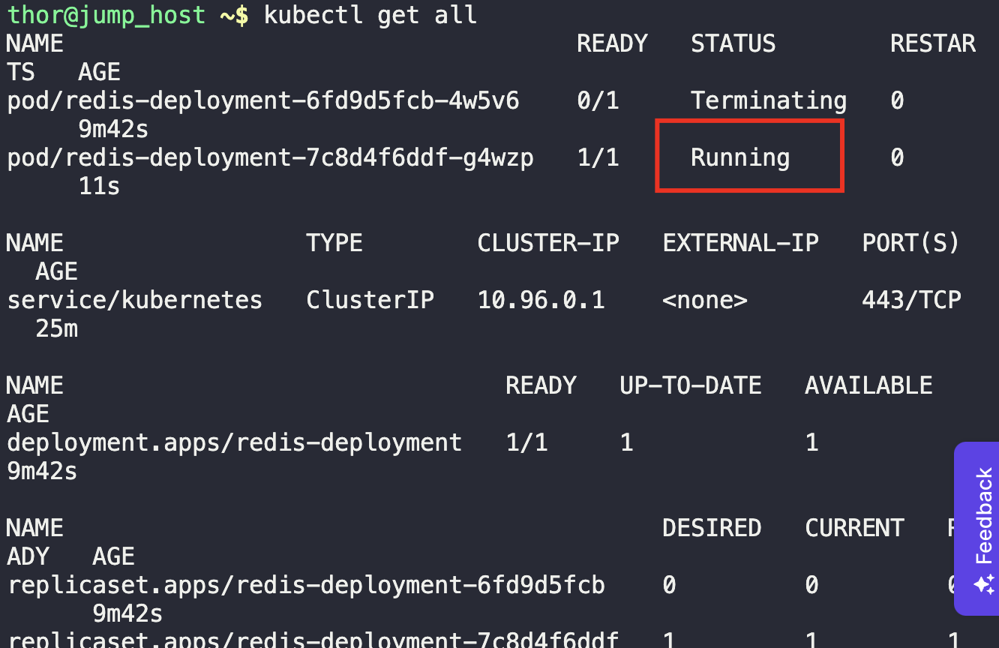

1. Check existing deployment and pods



2. Describe deployment configuration to check for errors







3. Edit deployment to make corrections
```
kubectl edit deployment
```




4. Verify running pod

