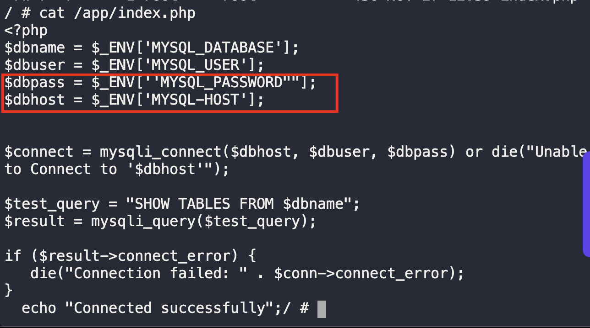
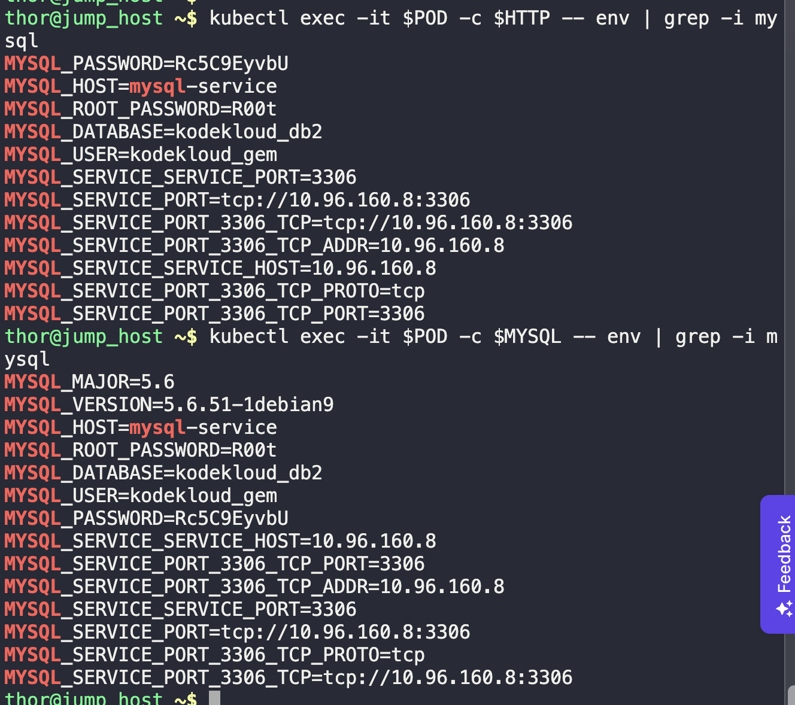

1. Click on the `App` button to check the error


2. Check deployment, pods, service and secrets
```
k get po,deploy,svc,secrets
```


3. Describe the containers in the pod
```
k describe pods {pod-name}
```


4. From the `httpd` container, test connectivity to the `MYSQL`
```
kubectl exec -it {pod-name} -c httpd-php-container -- mysql
```


* NOTE: The nodeport might differ from the given one, and the port and targetPort might be 8080. Change this to 80 by retrieving the YAML file and modify it.
```
k get svc lamp-service -o yaml > lamp-svc.yml

vi lamp-svc.yml

:%s/30009/30008/g 

:%s/8080/80/g 

k apply -f lamp-svc.yml 

k get svc
```


5. To ease troubleshooting, change the container names and pod name
```
HTTP=$(kubectl get pod  -o=jsonpath='{.items[*].spec.containers[0].name}') ; echo "HTTP: $HTTP"

MYSQL=$(kubectl get pod -o=jsonpath='{.items[*].spec.containers[1].name}')  ; echo "MYSQL: $MYSQL"

POD=$(kubectl get pods -o=jsonpath='{.items[*].metadata.name}'); echo "POD: $POD"
```


6. Check the logs of the httpd container
```
k logs -f $POD -c $HTTP 
```

 * The logs will show incorrect variable. To rectify this, modify the PHP file inside the HTTPD container, not the deployment file.

```
k exec -it $POD -c $HTTP -- sh

ls -la

ls -la /app
```


7. Check the `index.php` file. Here we can see that there's some typo error. Edit this to match the variables specified in the instructions/requirements.

```
cat /app/index.php
```




8. While inside the container, restart the php-fpm service.
```
service php-fpm restart

service php-fpm status
```

9. Check the environment variables in both containers.
```
kubectl exec -it $POD -c $HTTP -- env | grep -i mysql

kubectl exec -it $POD -c $MYSQL -- env | grep -i mysql

kubectl describe pod | grep -A 6 Env
```



10. Verify running app
