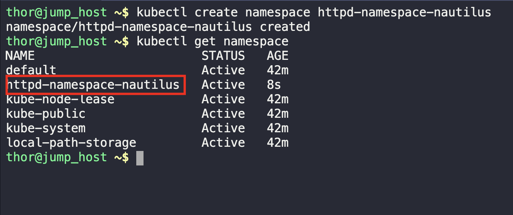
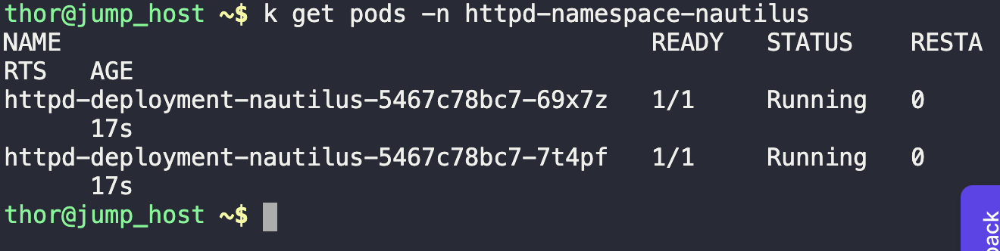
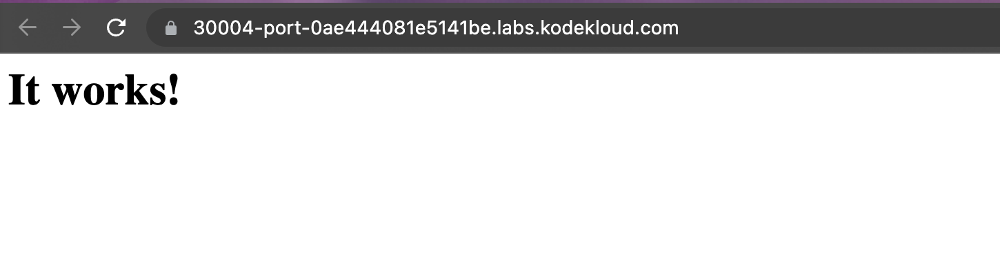

1. Create namespace as per task
```
kubectl create namespace httpd-namespace-nautilus

k get namespace
```



2. Create deployment and service as per task
```
vi apache.yaml

kubectl create -f apache.yaml
```

3. Verify Running pods and website
```
k get pods -n httpd-namespace-nautilus
```



