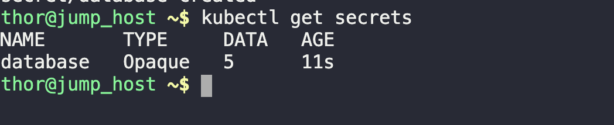
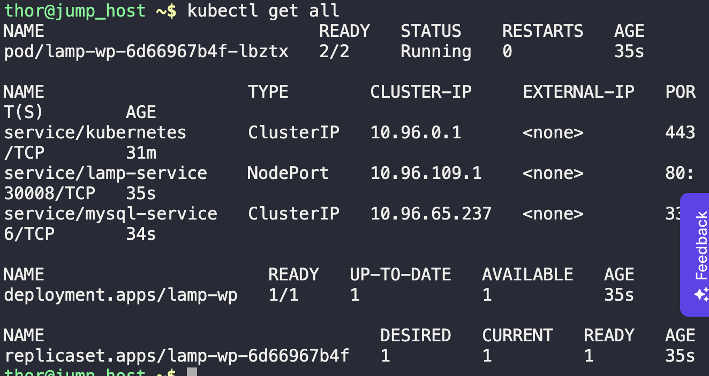
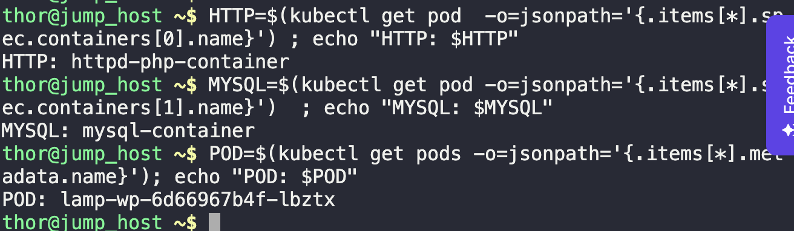
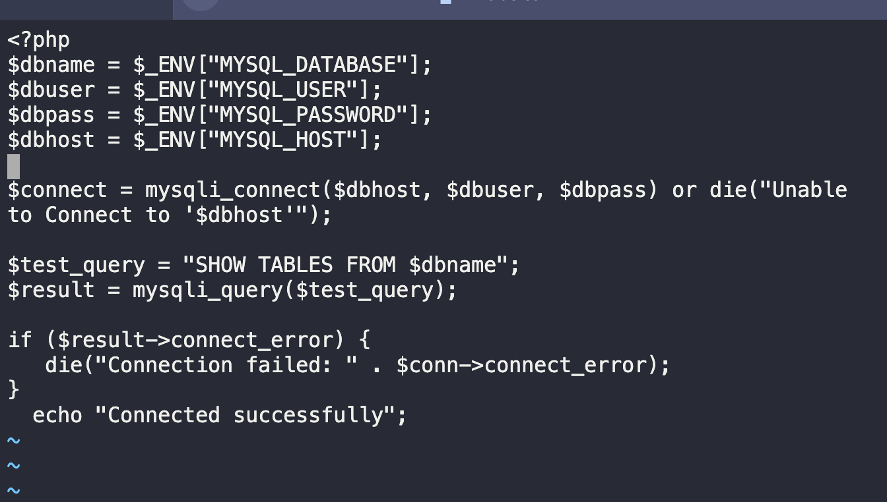
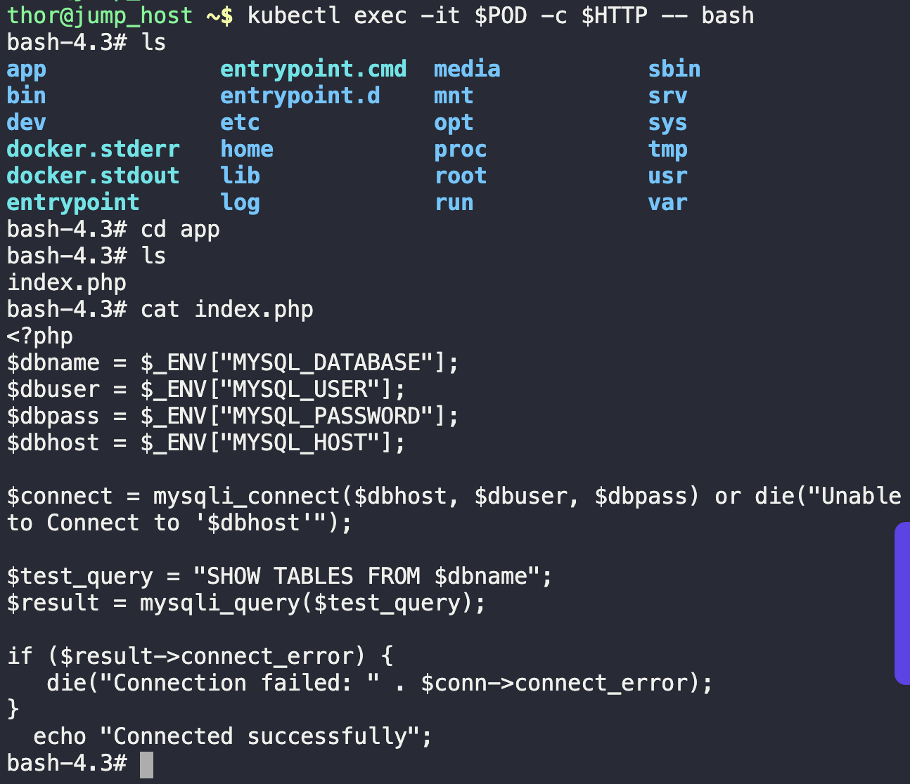
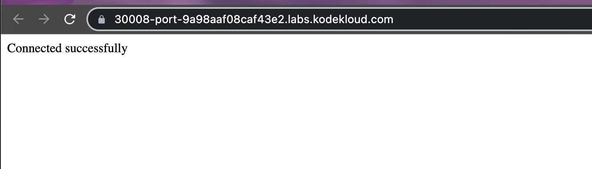

1. Create the generic secrets
```
kubectl create secret generic database \
--from-literal=MYSQL_ROOT_PASSWORD=admin123 \
--from-literal=MYSQL_DATABASE=kodekloud \
--from-literal=MYSQL_USER=kodekloud \
--from-literal=MYSQL_PASSWORD=admin123 \
--from-literal=MYSQL_HOST=mysql-service
```



2. Create deployment, service and configmap, then verify
```
kubectl create -f lamp.yaml

k get all
```



3. To ease troubleshooting, save container names and pods
```
HTTP=$(kubectl get pod  -o=jsonpath='{.items[*].spec.containers[0].name}') ; echo "HTTP: $HTTP"

MYSQL=$(kubectl get pod -o=jsonpath='{.items[*].spec.containers[1].name}')  ; echo "MYSQL: $MYSQL"

POD=$(kubectl get pods -o=jsonpath='{.items[*].metadata.name}'); echo "POD: $POD"
```



4. Edit the `/tmp/index.php`. Then copy this `index.php` to the HTTPD container, specifically to `/app` directory.
```
sudo vi /tmp/index.php

kubectl cp /tmp/index.php $POD:/app -c $HTTP
```



5. Verify file by accessing the HTTPD container.
```
kubectl exec -it $POD -c $HTTP -- bash
```



6. Also, verify by accessing the website button

