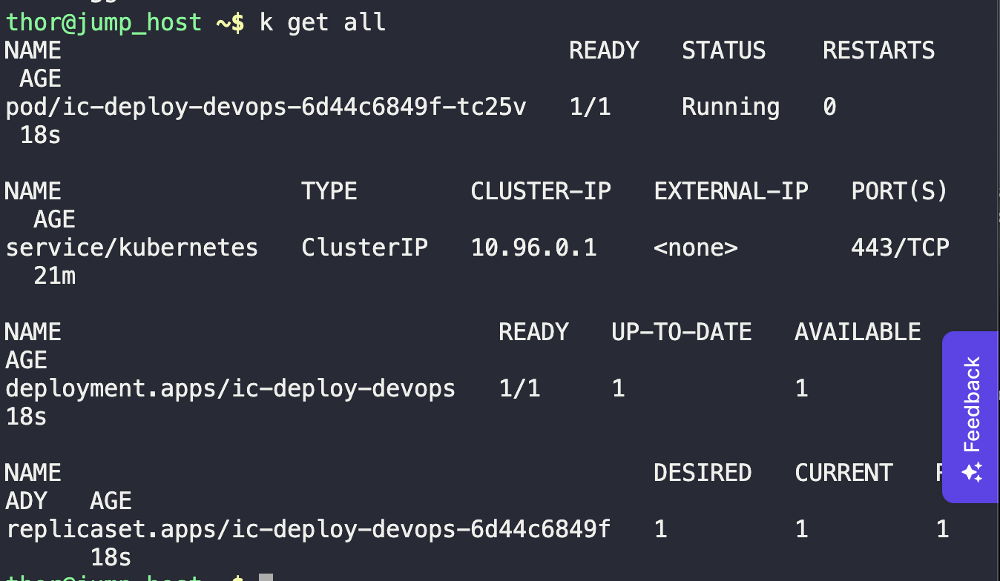
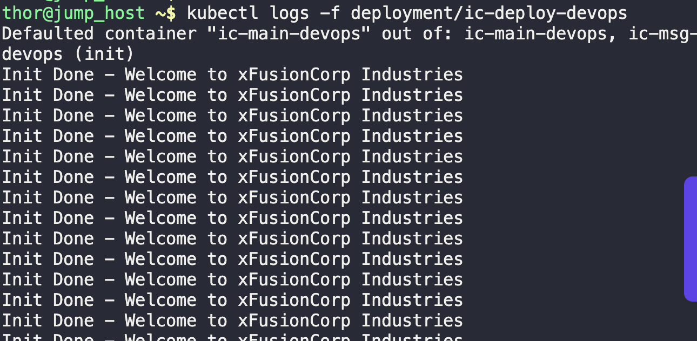

1. Create manifests as per task
```
vi init.yaml

kubectl create -f init.yaml
```

2. Ensure deployment and pods are running
```
k get all
```



3. Verify task by checking logs
```
kubectl logs -f deployment/ic-deploy-devops
```

