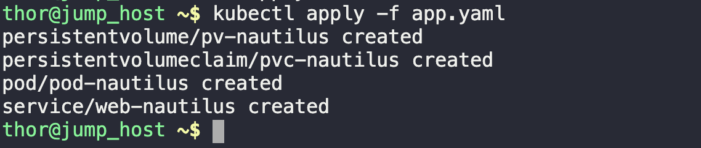
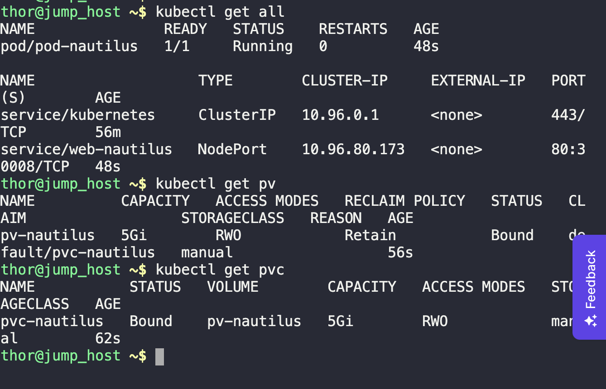
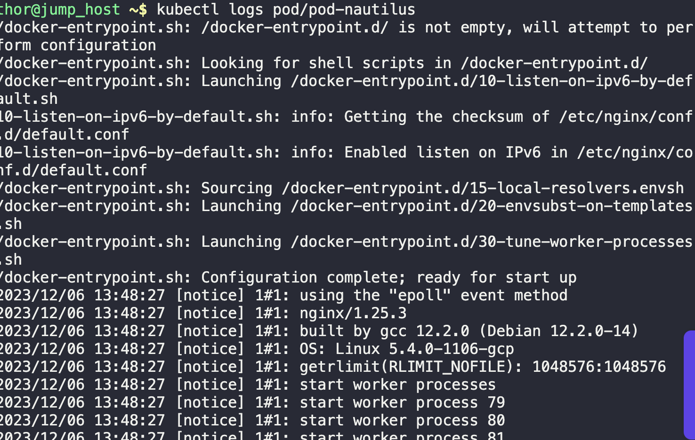

1. Create the resources as per task
```
vi app.yaml
```

Note:

* If image is httpd, document root is "/var/www/html"

* If image is nginx, document root is "/usr/share/nginx/html"

2. Apply.
```
kubectl apply -f app.yaml
```



3. Check resources.



