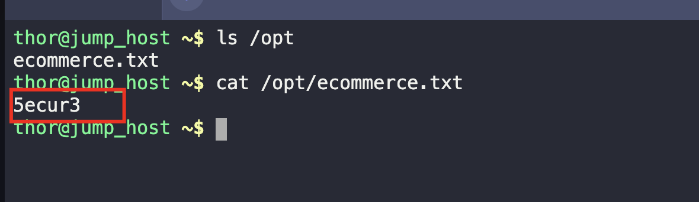
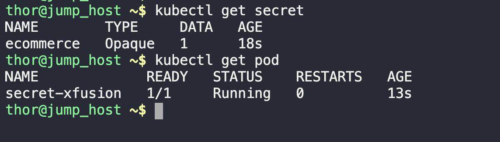
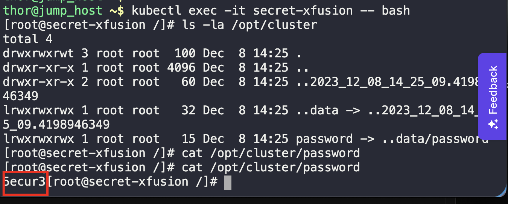

1. Verify the secret. 
```
ls -la /opt

cat /opt/ecommerce.txt
```



2. Create and Apply the YAML files for secret and pod.
```
kubectl apply -f secret.yml

kubectl apply -f secret-pod.yml
```

3. Verify successful creation.
```
kubectl get secret

kubectl get pod
```



4. Login to the pod and check if the secret is mounted.
```
kubectl exec -it {pod-name} -- bash
```

