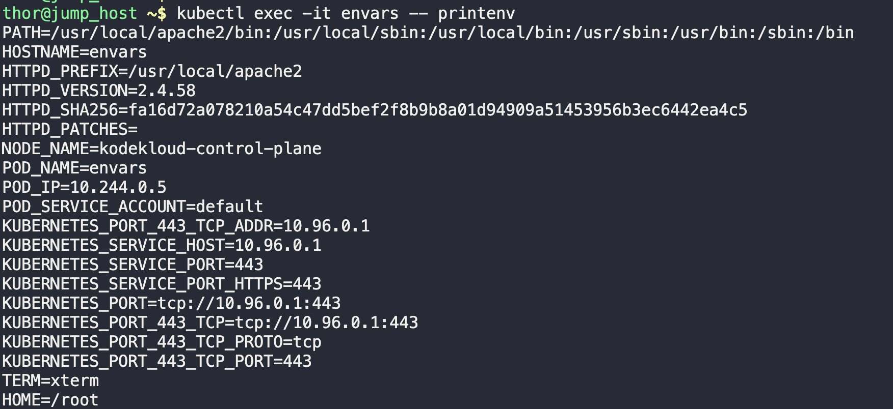

1. Check existing resources.
```
kubectl get all
```

2. Create and Apply the YAML file based on requirements.
```
vi env.yaml

kubectl apply -f env.yaml
```

3. Verify running pod.
```
kubectl get pod
```


4. Verify the environment variables by usign the exec module.
```
kubectl exec -it envars -- printenv
```

